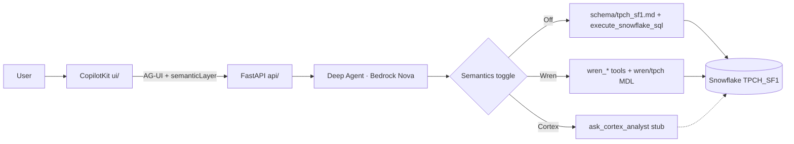
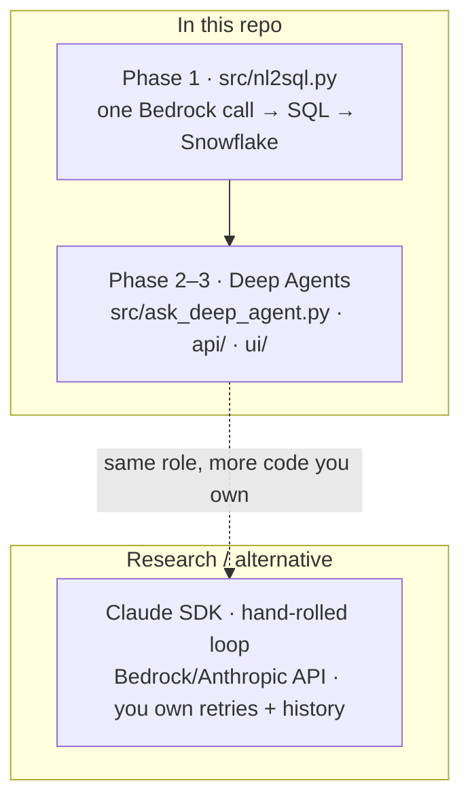
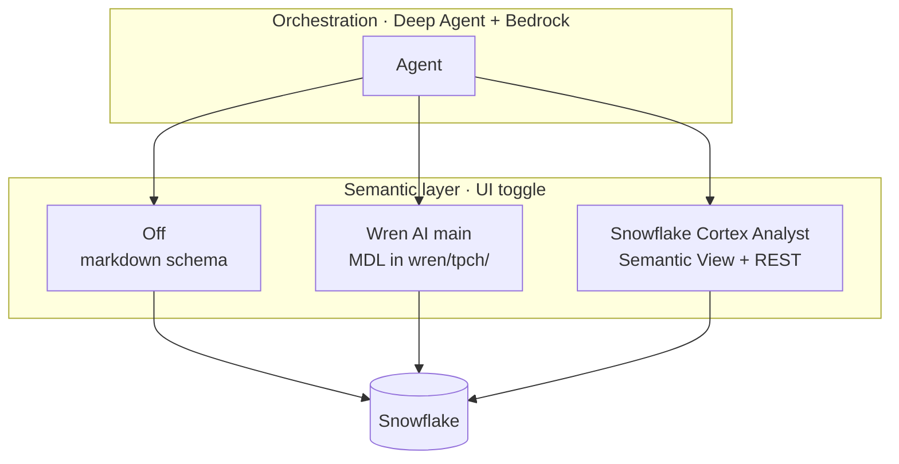

# AI SQL POC

Natural language → SQL on **Snowflake TPCH_SF1**, with **Amazon Bedrock (Nova Pro)** orchestration and an optional **[Wren AI](https://getwren.ai)** semantic layer (MDL in git).

This repo compares **how the agent runs** (one-shot vs Deep Agents vs Claude SDK) and **how semantics are defined** (markdown vs **Wren MDL** vs **Snowflake Cortex Analyst**). The CopilotKit UI exposes a **Semantics** toggle: **Off** | **Wren** | **Cortex**.

| Phase | What | Status |
|-------|------|--------|
| **1** | ChatBedrock single-shot NL→SQL | Done |
| **2** | LangChain Deep Agents + tools + chat memory | Done |
| **3** | CopilotKit UI + FastAPI AG-UI | Done |
| **4** | Wren `main` + Cortex Analyst harness | In progress — [plan](docs/plans/2026-06-01-004-feat-wren-ai-phase-4-plan.md) |

**Guides:** [docs/PHASES.md](docs/PHASES.md) · [Wren setup](wren/tpch/README.md) · [Harness comparison](docs/architecture/nl2sql-harness-comparison.md) · [Wren vs Cortex](docs/architecture/wren-vs-snowflake-cortex-analyst.md)

---

## Architecture

### This repo (what runs today)



- **Off** — model writes raw `TPCH_SF1.*` SQL (Phase 1–2 style).
- **Wren** — model writes SQL over MDL **models** (`customer`, `orders`, …); Wren expands and executes ([`wren/tpch/`](wren/tpch/)).
- **Cortex** — placeholder until Semantic View + Analyst REST are wired.

### Orchestration harnesses (who runs the agent loop?)

Same LLM quality for SQL if the prompt and schema are the same — the difference is **framework vs hand-rolled** vs **one-shot**.



| Harness | Role | In repo? |
|---------|------|----------|
| **Phase 1** | Single NL→SQL call, no tools | `src/nl2sql.py` |
| **Deep Agents** | Tool loop, memory, CopilotKit | **Yes** — primary path |
| **Claude SDK** | Custom agent without LangChain | Documented only — [comparison](docs/architecture/nl2sql-harness-comparison.md#deep-agents-vs-claude-sdk) |

### Semantic layer (what does “revenue” mean?)

Orthogonal to orchestration — pick a **primary** source of truth for joins and metrics.



| Mode | Contract | LLM | Status here |
|------|----------|-----|-------------|
| **Off** | `schema/tpch_sf1.md` in prompt | Bedrock | Working |
| **Wren** | MDL models, relationships, `instructions.md` | Bedrock (you bring LLM) | Working — `pip install "wrenai[snowflake,memory]"` |
| **Cortex** | Semantic View in Snowflake | Snowflake Cortex models | Stub only |

Deep dive: [NL→SQL harness comparison](docs/architecture/nl2sql-harness-comparison.md) · [Wren vs Cortex Analyst](docs/architecture/wren-vs-snowflake-cortex-analyst.md) · [agent error handling](docs/architecture/agent-error-handling.md)

---

## Repository layout

```
.
├── src/                    # Python POC (Phase 1 + 2 + shared agent)
│   ├── agent_factory.py    # Deep Agent graph (CLI + API)
│   ├── semantic_editor/    # Editor agent, file APIs, PR workflow (plan 006)
│   ├── nl2sql.py           # Phase 1 core: ChatBedrock + Snowflake
│   ├── run_baseline_test.py
│   ├── ask_questions.py    # Phase 1 interactive
│   ├── ask_deep_agent.py   # Phase 2 interactive
│   ├── agent_streaming.py  # Phase 2 --verbose steps
│   ├── semantic_layer/     # Off/Wren/Cortex prompts + retry policy
│   └── tools/              # Snowflake, Wren, Cortex tools
├── wren/tpch/              # Wren MDL (TPCH_SF1) — build → target/mdl.json (gitignored)
├── ui/                     # Phase 3B — CopilotKit + Vite React
├── api/                    # Phase 3B — FastAPI AG-UI server
├── config/                 # Local secrets (snowflake_config.py gitignored)
├── schema/                 # tpch_sf1.md — shared by all phases
├── scripts/                # py, sync_wren_profile.py, diagnose_bedrock.py
├── sql/                    # Optional Snowflake setup
├── docs/                   # Plans + architecture
└── web/                    # Phase 3A (parked) — Amplify Gen 2 scaffold
```

---

## Setup (all phases)

```bash
cd ~/Documents/GitHub/personal_build   # or your clone of ai-sql-poc

scripts/py -m pip install -r requirements.txt

cp config/snowflake_config.example.py config/snowflake_config.py
# edit config/snowflake_config.py

export AWS_PROFILE=Brainfore-Team-Set-654654461736
aws sso login --profile $AWS_PROFILE
scripts/py scripts/diagnose_bedrock.py
```

Use `scripts/py` instead of plain `python` on Mac (Homebrew vs Anaconda).

---

## Run Phase 1 only (ChatBedrock)

**Files:** `src/nl2sql.py` · `src/run_baseline_test.py` · `src/ask_questions.py`

```bash
scripts/py src/run_baseline_test.py   # one-shot test
scripts/py src/ask_questions.py       # ask your own questions
```

No Deep Agent or Wren files involved.

---

## Run Phase 2 only (Deep Agents)

**Files:** Phase 1 core + `src/ask_deep_agent.py` · `src/tools/` · `src/agent_streaming.py`

```bash
scripts/py src/ask_deep_agent.py              # interactive + follow-up memory
scripts/py src/ask_deep_agent.py --verbose    # show planning / tool steps
scripts/py src/ask_deep_agent.py --semantic-layer wren   # Wren MDL tools
```

Type `clear` in the REPL to reset conversation memory.

---

## Phase 3 — Web UI (CopilotKit, local)

**Files:** `ui/` · `api/` · `wren/tpch/` · `src/agent_factory.py` (shared with Phase 2 CLI)

**Active path:** CopilotKit + Vite in `ui/`, FastAPI agent server in `api/`. Three views: **Chat**, **Audit logs**, **Semantic layer** (MDL editor + PR workflow + editor AI). Header **Semantics**: **Off** | **Wren** | **Cortex** (applies to chat only).

**Parked path:** `web/` Amplify Gen 2 — blocked on CDK bootstrap ([learnings](docs/solutions/aws-amplify-cdk-bootstrap-blocked.md)).

### Install (first time)

```bash
scripts/py -m pip install -r requirements.txt
# Wren mode:
scripts/py -m pip install "wrenai[snowflake,memory]" pyyaml
cd ui && npm install && cd ..
```

### Run — two terminals

```bash
# Terminal 1 — API
export AWS_PROFILE=Brainfore-Team-Set-654654461736
aws sso login --profile $AWS_PROFILE
scripts/py scripts/sync_wren_profile.py   # once, for Wren mode
cd wren/tpch && wren context build && wren memory index   # once, for Wren mode
scripts/py -m uvicorn api.main:app --reload --port 8000

# Terminal 2 — UI
cd ui && npm run dev
```

Open **http://localhost:5173** — **Chat** uses the SQL Assistant on the right; **Semantic layer** adds file edit, validate, PR, and a separate editor AI agent.

Details: [ui/README.md](ui/README.md) · [Semantic layer editor](docs/architecture/semantic-layer-editor.md) · [wren/tpch/README.md](wren/tpch/README.md) · [docs/PHASES.md](docs/PHASES.md#phase-3b--copilotkit-active-local)

---

## Security

Three layers block secrets and profile files from landing on `main`:

| Layer | What | When |
|-------|------|------|
| **Local** | Gitleaks + path check via pre-commit | Every `git commit` |
| **CI — secrets** | `.github/workflows/secret-scan.yml` | Every PR and push to `main` |
| **CI — quality** | `.github/workflows/ci.yml` (`python-tests`, `ui-build`) | Every PR and push to `main` |
| **Merge gate** | Branch protection requires all four checks | Before merge |

**Never commit:** `config/snowflake_config.py`, `wren/profiles.yml`, `~/.wren/profiles.yml`, `.env`, AWS keys. Templates like `snowflake_config.example.py` and `.env.example` are fine.

### One-time local setup

```bash
pip install pre-commit   # or: brew install pre-commit
pre-commit install
pre-commit run --all-files   # optional smoke test
```

Manual scans: `pre-commit run gitleaks --all-files` · `scripts/check-sensitive-paths.sh --staged`

### Branch protection (merge gate)

After `.github/workflows/secret-scan.yml` has run at least once on a PR:

**Option A — GitHub UI**

1. Repo → **Settings** → **Branches** → add/edit rule for `main`
2. Enable **Require a pull request before merging**
3. Enable **Require status checks to pass** and select **`gitleaks`**, **`block-sensitive-paths`**, **`python-tests`**, and **`ui-build`**

**Option B — CLI** (repo admin + `gh auth login`):

```bash
scripts/setup-branch-protection.sh
```

See [config/README.md](config/README.md) for credential setup.

## Docs

- [docs/PHASES.md](docs/PHASES.md) — isolate Phase 1 / 2 / 3
- [docs/README.md](docs/README.md) — plans and requirements index
- [Semantic layer editor](docs/architecture/semantic-layer-editor.md) — file editor, PR workflow, dual agents
- [NL→SQL harness comparison](docs/architecture/nl2sql-harness-comparison.md) — Deep Agents, Claude SDK, Wren, Cortex
- [Wren vs Cortex Analyst](docs/architecture/wren-vs-snowflake-cortex-analyst.md)
- [Agent error handling](docs/architecture/agent-error-handling.md)
