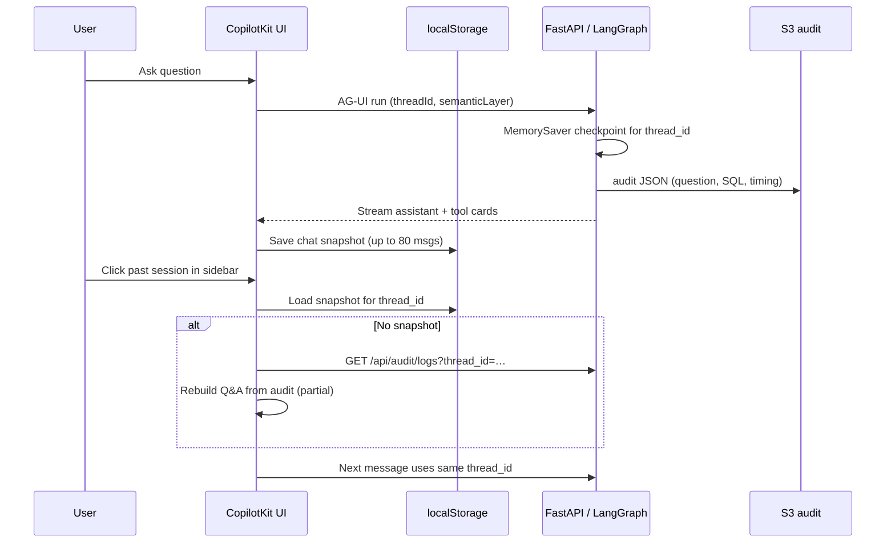

# Chat memory and sessions

How conversations, threads, and history work in this POC — and how that differs from audit logging and Wren semantic memory.

**See also:** [query-and-memory-storage.md](query-and-memory-storage.md) (full storage map) · [audit-logs/README.md](../audit-logs/README.md) · [agent-error-handling.md](agent-error-handling.md)

---

## Terms (don’t conflate these)

| Term | What it is | Example in this repo |
|------|------------|----------------------|
| **Thread** | One conversation keyed by a UUID | `24b28d33-3ca2-425e-8212-dccc30ea568c` |
| **Session (UI)** | A thread the user can pick from **Chat history** | Grouped from audit log by `thread_id` |
| **Chat memory** | What the agent uses for **follow-ups** (“same but by region”) | LangGraph checkpointer + message list |
| **Chat snapshot** | **Display** copy of messages in the browser | `localStorage` `ai-sql-poc-chat-snapshots` |
| **Audit log** | **Compliance / debug** record per agent run | S3 `audit/YYYY/MM/DD/{thread_id}/{run_id}.json` |
| **Wren memory** | **Semantic** NL↔SQL recall for similar questions | `wren memory index` → LanceDB under `wren/tpch/target/` |

Chat memory, snapshots, audit, and Wren memory are **four different stores** with different lifetimes and purposes.

---

## End-to-end flow



---

## Thread ID lifecycle

| Event | What happens to `thread_id` |
|-------|----------------------------|
| First visit | New UUID; stored in `localStorage` (`ai-sql-poc-thread-id`) |
| **+ New** (sidebar) or **Clear conversation** (right panel) | New UUID; old server checkpoint stays in API RAM until process exit |
| **Chat history** click | Reuses that session’s UUID; UI restores messages from snapshot or audit |
| **Semantics** toggle (Off / Wren / Cortex) | New UUID (new LangGraph context for the mode) |
| API restart | Same UUID in browser, but **server follow-up memory is empty** |

The thread ID is the join key across UI, LangGraph, retry policy, and audit.

---

## Where each layer lives

### 1. Server follow-up memory (LangGraph)

| | |
|--|--|
| **Code** | `MemorySaver()` (default) or `PostgresSaver` via `src/checkpoint_factory.py` when `DATABASE_URL` is set |
| **Key** | `config.configurable.thread_id` (from AG-UI / `HttpAgent`) |
| **Survives** | Browser refresh **if** same thread id **and** API still running; **API restart** only with Postgres |
| **Lost when** | uvicorn restart with MemorySaver; deploy without durable checkpointer |

This is what lets the model answer “now filter that to 2024” without you repeating the first question. It is **not** persisted to disk in the POC.

### 2. Browser chat snapshots (UI restore)

| | |
|--|--|
| **Code** | `ui/src/lib/chatPersistence.ts`, `ui/src/components/ChatPane.tsx`, `ui/src/hooks/useActiveThreadPersistence.ts` |
| **Key** | `localStorage` → `ai-sql-poc-chat-snapshots` → `{ [threadId]: Message[] }` |
| **Limit** | Last **80** storable messages per thread (user/assistant text) |
| **Survives** | Refresh, switching sessions, Audit logs view |
| **Lost when** | Clear site data, different browser/device, private mode quirks |

Snapshots are saved **before** switching threads and on every message change. They restore what you **see** in chat; tool cards and rich formatting may be simplified.

### 3. Chat history list (sidebar)

| | |
|--|--|
| **API** | `GET /api/audit/sessions` → groups audit records by `thread_id` |
| **UI** | `ui/src/components/ChatHistoryList.tsx` |
| **Title** | First question in that thread |
| **Scope** | API runs only (`source: api`); CLI `thread_id: cli` excluded |

The list is **derived from audit**, not a separate sessions table. No audit entry → no sidebar row.

### 4. Query audit (per run, not full transcript)

| | |
|--|--|
| **Code** | `src/audit_logger.py`, `src/ag_ui_agent.py` |
| **Primary store** | S3 (see [audit-logs/README.md](../audit-logs/README.md)) |
| **Per run** | `question`, `semantic_layer`, `sql_executions`, `duration_ms`, `status` |
| **Not stored** | Full assistant prose, full result rows, tool UI state |

When snapshots are missing, the UI can **reconstruct** a read-only thread: user question + SQL/previews from audit. That is weaker than a true transcript.

### 5. SQL retry state (per thread, ephemeral)

| | |
|--|--|
| **Code** | `src/semantic_layer/retry_policy.py` → `_SESSION` |
| **Purpose** | Max 3 SQL attempts, detect repeated errors |
| **Lost when** | API restart |

### 6. Wren semantic memory (optional, Wren mode only)

| | |
|--|--|
| **Code** | `wren_memory_fetch` in `src/tools/wren_tools.py` |
| **Store** | `wren/tpch/target/` after `wren memory index` |
| **Purpose** | Retrieve similar past **questions/SQL** for the semantic layer |
| **Not** | Full chat history or user sessions |

---

## UI surfaces

| Surface | Role |
|---------|------|
| **Left sidebar → Chat history** | Pick a past thread; **+ New** starts fresh |
| **Right sidebar → Session** | Current thread id, message count, clear chat, memory explainer |
| **Left sidebar → Audit logs** | Inspect runs (SQL, timing, errors) — not the chat UX |

`ActiveThreadFlushBridge` saves the outgoing thread **before** `threadId` changes. `ChatPane` loads that thread’s snapshot/audit, then `reset()` + `setMessages()`. Re-clicking a session in the sidebar reloads it from storage.

---

## Key files

```
src/agent_factory.py              # MemorySaver checkpointer
src/ag_ui_agent.py                # thread_id + audit after each run
src/semantic_layer/retry_policy.py
src/audit_logger.py / audit_reader.py
api/main.py                       # /api/audit/sessions, /api/audit/logs

ui/src/App.tsx                    # selectThread: flush → set threadId; CopilotKit threadId prop
ui/src/lib/httpAgent.ts           # threadId on each AG-UI request
ui/src/lib/chatPersistence.ts
ui/src/lib/resolveThreadMessages.ts
ui/src/components/ChatPane.tsx
ui/src/components/ActiveThreadFlushBridge.tsx
ui/src/components/ChatHistoryList.tsx
ui/src/hooks/useActiveThreadPersistence.ts
ui/src/hooks/useChatSession.ts
```

---

## POC limitations (intentional)

1. **No durable server checkpointer** — follow-ups die on API restart even if the UI shows old messages.
2. **Snapshots are browser-local** — not shared across users or devices.
3. **Audit ≠ transcript** — session list and fallback restore are run-oriented, not pixel-perfect chat replay.
4. **Semantic mode change = new thread** — Off/Wren/Cortex don’t share one LangGraph checkpoint.
5. **80-message cap** per thread in localStorage.

---

## Troubleshooting

| Symptom | Likely cause | What to check |
|---------|--------------|---------------|
| Follow-up ignores prior answer | API restarted | New question or accept fresh context; server RAM cleared |
| Sidebar empty | No audit yet | Ask a question; S3 sync on `/api/status` |
| Old messages missing after session click | Outgoing thread not saved before switch | Fixed: flush before `threadId` change; click session again to reload |
| Messages show but follow-ups fail | UI restored from audit/snapshot; server state empty | Expected after restart — start new thread or re-ask with context |
| Session shows wrong mode in list | Audit `semantic_layer` on each run | Toggle mode starts a new thread |

---

## Roadmap (CTA / production-shaped)

From [query-and-memory-storage.md](query-and-memory-storage.md):

1. **Durable checkpointer** — Postgres via Docker Compose when `DATABASE_URL` is set ([postgres-local-dev.md](postgres-local-dev.md)). CLI still uses MemorySaver.
2. **Server-side session store** — relational `sessions` + `messages` (user id, title, updated_at).
3. **Unify audit + transcript** — audit for compliance; messages table for UX (can share `thread_id`).
4. **User-scoped history** — auth + row-level security; no cross-user session leakage.

**Learnings doc:** [chat-memory-and-session-learnings.md](../solutions/chat-memory-and-session-learnings.md)

---

## Related docs

- [query-and-memory-storage.md](query-and-memory-storage.md) — POC vs CTA storage matrix
- [postgres-local-dev.md](postgres-local-dev.md) — Docker Compose + `DATABASE_URL`
- [audit-logs/README.md](../audit-logs/README.md) — S3 audit setup and record shape
- [copilotkit-local-ui-learnings.md](../solutions/copilotkit-local-ui-learnings.md) — AG-UI, checkpointer, UI pitfalls
- [chat-memory-and-session-learnings.md](../solutions/chat-memory-and-session-learnings.md) — session switching pitfalls and fixes
