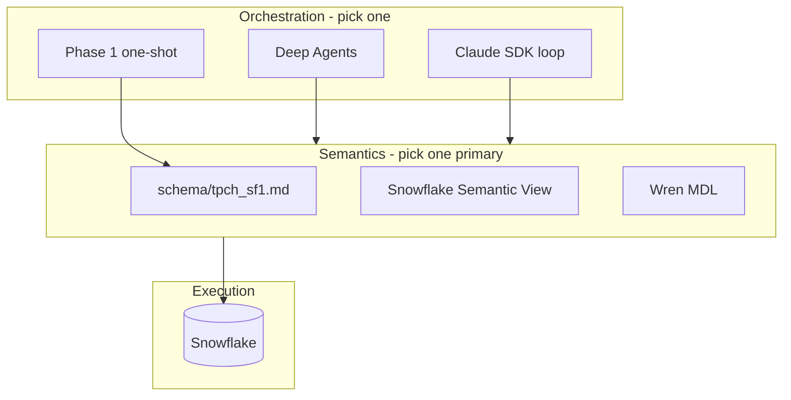
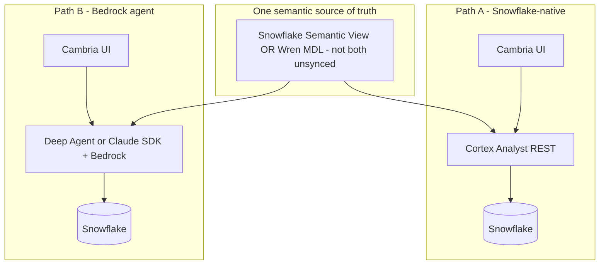

# NL→SQL harness comparison

**Status:** Architecture research  
**Date:** 2026-06-01  
**Scope:** Phase 1 baseline, Deep Agents, Claude SDK, Wren `main`, Snowflake Cortex Analyst  

**Related:** [Wren vs Cortex Analyst](wren-vs-snowflake-cortex-analyst.md) · [Phase 4 plan](../plans/2026-06-01-004-feat-wren-ai-phase-4-plan.md)

---

## How to read this

These options are **not all the same kind of thing**:

| Kind | Options |
|------|---------|
| **Orchestration** (who runs the loop?) | Phase 1 one-shot, **Deep Agents**, **Claude SDK** |
| **Semantics + SQL planning** (what does “revenue” mean?) | Markdown schema, **Semantic Views**, **Wren MDL** |
| **Managed NL→SQL product** | **Cortex Analyst** |

**Deep Agents** and **Claude SDK** answer: *How does the assistant think, call tools, and retry?*  
**Wren** and **Cortex** answer: *How do we stop the model from guessing joins and metrics?*

You can **combine** them (e.g. Deep Agents + Wren tools, or Deep Agents + Cortex REST).

---

## This repo today

| | **Phase 1** (`src/nl2sql.py`) | **Phase 2** (`src/ask_deep_agent.py`) |
|--|-------------------------------|-------------------------------------|
| Flow | One Bedrock call → SQL → `run_sql()` | Agent: schema tool → SQL → execute → retry on error |
| Context | `schema/tpch_sf1.md` in prompt | Same markdown + `get_schema_summary` tool |
| LLM | Bedrock Nova via LangChain | Same |
| Semantics | Informal markdown | Same — no governed metric layer |

Phase 2 is Phase 1 plus **agent loop + tools + conversation memory**, not a new semantic layer.

---

## Five-way comparison

| | **Phase 1** | **Deep Agents** | **Claude SDK** | **Wren `main`** | **Cortex Analyst** |
|--|-------------|-----------------|----------------|-----------------|---------------------|
| **What it is** | Single LLM call | LangChain agent framework | Hand-rolled agent loop | Semantic engine + MDL | Snowflake managed NL→SQL |
| **Code you own** | Small core module | Agent + tools + prompt | Gateway, retry, parse, SQL | MDL + integration | Semantic View + REST client |
| **LLM** | Bedrock (your choice) | Bedrock | Bedrock or Anthropic API | **Your** LLM (e.g. via agent) | Snowflake Cortex models |
| **Semantic layer** | Markdown in prompt | Markdown + optional tool | Whatever you put in prompt | **MDL** in git | **Semantic View** in Snowflake |
| **SQL path** | Model → raw Snowflake SQL | Model → raw SQL | Model → raw SQL | SQL on **models** → Wren expands | Analyst → SQL |
| **Execution** | `nl2sql.run_sql` | `execute_snowflake_sql` tool | Your connector | Wren connector | Snowflake |
| **Retry / errors** | Manual re-ask | Agent loop (prompt-limited) | You implement | Agent + `dry-plan` / `dry-run` | Analyst internal |
| **Conversation** | Per script | `messages` history | You implement | Your agent | REST `messages` |
| **Non-SQL tools** | No | Yes — add tools | Yes if you build | Via your agent only | No — SQL focused |
| **Ops burden** | Minimal | Medium (LangGraph, etc.) | Medium | Medium + MDL modeling | Low if already on Snowflake |

---

## Deep Agents vs Claude SDK

Both use **your LLM** and **your UI**. The difference is **framework vs hand-rolled**.

### Deep Agents (Phase 2)

```text
User → create_deep_agent(Bedrock, tools, system_prompt)
         → plan / tool calls / retry / message history
         → execute_snowflake_sql, get_schema_summary
```

**Implementation in this repo:** `src/ask_deep_agent.py`, `src/tools/snowflake_tools.py`

**Pros**

- Agent loop, tool calling, follow-ups are already in place.
- Fits CopilotKit, LangGraph, LangSmith later.
- New capabilities (Cortex REST, Wren `dry-plan`, auth) = register a tool.

**Cons**

- No formal semantic layer — joins and metrics live in prompt + markdown.
- Framework weight and latency vs a tight custom loop.
- Correctness depends on prompt engineering and retries, not a planner.

**Best when:** The product is an **agent** (multi-step, follow-ups, mixed tools) and LangChain is acceptable.

### Claude SDK (custom)

```text
User → your Python: build messages + schema
         → anthropic.AnthropicBedrock().messages.create(...)
         → parse SQL → snowflake.connector.execute
         → on error, append error and call again
```

**Pros**

- Smallest dependency surface — no LangChain / Deep Agents.
- Full control of prompts, parsing, validation, logging, cost caps.
- Clear security story (“this module calls Bedrock, this one Snowflake”).

**Cons**

- You rebuild what Deep Agents already provides: tools, retries, history, streaming.
- Same semantic weakness unless you add Semantic Views, Wren, or rich context.
- Every improvement (verified queries, ambiguity) is custom code.

**Best when:** Minimal stack, no LangChain, and you accept owning the agent loop.

### Verdict: Deep Agents vs Claude SDK

| Question | Lean |
|----------|------|
| Need follow-ups, tools, retries soon? | **Deep Agents** |
| Need smallest codebase / no LangChain? | **Claude SDK** |
| Need governed metrics and joins? | **Neither alone** — add Semantic Views, Wren, or one synced source |

Claude SDK is **not** more accurate than Deep Agents for SQL by itself — same LLM, same schema-in-prompt. It trades **framework** for **lines of code you own**.

---

## How Wren and Cortex relate to Deep Agents / Claude SDK



### Deep Agents + Wren

- Agent keeps: conversation, Cambria UI, Bedrock, arbitrary tools.
- Wren adds: `wren-langchain` tools (`dry-plan`, query on **models**, memory).
- **Replaces:** join/metric guessing from markdown.
- **Does not replace:** the agent runtime.

### Deep Agents + Cortex

- Tool: `ask_cortex_analyst(question)` → REST → SQL + result.
- **Replaces:** home-grown NL→SQL for Snowflake-only questions.
- Agent still owns multi-step and non-SQL work.

### Claude SDK + Semantic View

- Analyst API or view metadata in your hand-rolled loop.
- Same semantic uplift as Deep Agents + Cortex; less framework.

### Claude SDK + Wren

- Call `wrenai` SDK from your loop instead of LangChain tools.
- Same pattern as Deep Agents + Wren; different orchestration.

---

## One semantic source of truth

Define business meaning **once**. Wire the app in one of two ways:



**Path A — Cortex REST:** Semantic View in Snowflake → Cambria calls Analyst API → SQL runs in account. No Wren MDL.

**Path B — Bedrock agent:** Same Semantic View (or MDL) → Deep Agent / Claude SDK uses it via tools or prompt → Bedrock orchestrates, Snowflake executes.

**Avoid:** Semantic View says `revenue = SUM(a)` while MDL says `revenue = SUM(b)` with no sync pipeline.

Wren can sit as an **agent-facing projection** on top of dbt or warehouse semantics ([Wren stack position](https://docs.getwren.ai/oss/concepts/stack_position)) — the warning is **duplicate ownership without sync**.

---

## Accuracy and governance (SQL-heavy questions)

For questions like “revenue by segment with correct joins”:

| Approach | Typical join/metric reliability |
|----------|----------------------------------|
| Phase 1 / Claude SDK / Deep Agents + **markdown only** | Lowest — model infers |
| + **Semantic View** (Analyst or rich prompt) | High for Snowflake |
| + **Wren MDL** + planner | High if MDL is maintained |
| Deep Agents + **Wren or Cortex** | High — semantics fixed; agent handles dialogue |

- **Deep Agents** → behavior (retry, follow-ups, tools).  
- **Wren / Cortex** → SQL semantics.  
- **Claude SDK** → simplicity, not semantics.

---

## When to choose what (CTA-shaped)

| Goal | Choice |
|------|--------|
| Fastest POC, learn the stack | Phase 1 or Claude SDK + markdown |
| Product = chat agent in Cambria + Bedrock | **Deep Agents** |
| Minimize dependencies, own every line | **Claude SDK** loop |
| Snowflake-only, governance in warehouse, Cortex LLMs OK for SQL | **Semantic Views + Cortex Analyst** |
| Bedrock agent + git semantics + possible multi-DB | **Deep Agents + Wren tools** |
| Avoid duplicate semantics | **One of:** Semantic View **or** MDL |

---

## Recommended phase stack

| Phase | Role |
|-------|------|
| **1** | Prove Bedrock + Snowflake (`src/nl2sql.py`) |
| **2** | Prove **agent UX** — retry, follow-ups, tools (`src/ask_deep_agent.py`) |
| **3** | **Our UI** (CopilotKit) — see [CopilotKit semantic toggle plan](../plans/2026-06-01-005-feat-copilotkit-semantic-layer-toggle-plan.md) |
| **4** | MDL + Semantic View + harness scores; feeds Wren/Cortex modes in UI |

### CopilotKit: one UI, three semantic modes

The production shape for Phase 3 is **not** three separate apps. It is one CopilotKit shell with a **mutually exclusive** control:

| UI mode | Backend |
|---------|---------|
| **Off** | `get_schema_summary` + `execute_snowflake_sql` (today) |
| **Wren** | Wren MDL tools + same agent |
| **Cortex** | `ask_cortex_analyst` tool when Semantic View exists |

Mode is sent on each AG-UI run (`configurable.semantic_layer` or header). **Never** run Wren and Cortex semantics on the same turn.

**Claude SDK:** Fallback if LangChain is dropped — rewrite Phase 2 loop, not a third parallel product path unless intentional.

**Strong hybrid:** **Deep Agents + Semantic View (Cortex tool) OR Deep Agents + Wren tools** — agent owns Cambria/Bedrock; warehouse or Wren owns meaning.

**Weak combo:** Drop Deep Agents for Claude SDK **and** add Wren without modeling — rewrote orchestration, semantics still thin.

---

## One-line summary

| Stack | One line |
|-------|----------|
| **Phase 1** | Cheap baseline; model guesses SQL from markdown. |
| **Deep Agents** | **Product runtime**; still guesses semantics without a layer. |
| **Claude SDK** | Same SQL quality as Deep Agents with less framework, more custom code. |
| **Wren `main`** | **Semantic + planner** for your agent; not a replacement for Deep Agents. |
| **Cortex Analyst** | **Snowflake’s** semantic + NL→SQL; competes with Wren on meaning, not on orchestration. |

---

## Sources

- [Cortex Analyst](https://docs.snowflake.com/en/user-guide/snowflake-cortex/cortex-analyst)
- [Semantic Views](https://docs.snowflake.com/en/user-guide/views-semantic/semantic-view-yaml-spec)
- [Wren OSS architecture](https://docs.getwren.ai/oss/reference/architecture)
- [Wren stack position](https://docs.getwren.ai/oss/concepts/stack_position)
- [LangChain Deep Agents](https://docs.langchain.com/oss/python/deepagents/overview)
- Repo: `src/nl2sql.py`, `src/ask_deep_agent.py`, `schema/tpch_sf1.md`
