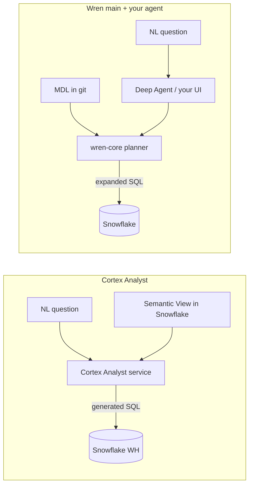

# Wren AI (main) vs Snowflake Cortex Analyst

**Status:** Research note for Phase 4 harness selection  
**Date:** 2026-06-01  
**Decision context:** We use **Wren `main` only** (open context layer). We do **not** use `legacy/v1` GenBI or Wren’s product UI. User-facing chat is **our** UI (Phase 3) or CLI during POC.

**See also:** [NL→SQL harness comparison](nl2sql-harness-comparison.md) — Deep Agents, Claude SDK, Phase 1, Wren, and Cortex in one place.

---

## What each product actually is

| | **Snowflake Cortex Analyst** | **Wren AI (`main`)** | **This repo (Phases 1–2)** |
|--|------------------------------|----------------------|----------------------------|
| **Category** | Managed warehouse-native text-to-SQL | OSS **semantic context layer** for agents | General LLM agent + SQL tools |
| **You get** | REST API + Snowflake-hosted LLMs + semantic routing | MDL + planner (`wren-core`) + memory + CLI/SDK + `wren-langchain` tools | Full control of prompt, tools, Bedrock, UX |
| **Semantic contract** | **Semantic Views** (recommended) or legacy YAML on a stage | **MDL** in git (`models/`, `relationships.yml`, `instructions.md`) | `schema/tpch_sf1.md` in prompt |
| **NL→SQL** | Snowflake picks models, generates SQL, runs in account | **Your agent** (or you) writes SQL over model names; Wren expands to warehouse SQL | Model writes raw Snowflake SQL |
| **LLM** | Cortex models inside Snowflake (Claude Sonnet, GPT-4.1, Arctic Text2SQL, etc.) — **not user-selectable per request**; optional Azure OpenAI | **You bring the LLM** (e.g. Bedrock Nova/Claude via Deep Agents) | Bedrock (Nova Pro) |
| **Data boundary** | Prompts/metadata stay in Snowflake governance boundary (for default Cortex models) | Wren runs in **your** runtime; queries go to Snowflake via connector | Same as Wren path if you host the agent |
| **UI** | None shipped as your app — you embed via REST / Streamlit samples | **No chat UI** on main — profile setup UI only | CopilotKit / Amplify (planned) |

**Sources:** [Cortex Analyst](https://docs.snowflake.com/en/user-guide/snowflake-cortex/cortex-analyst), [Semantic Views YAML](https://docs.snowflake.com/en/user-guide/views-semantic/semantic-view-yaml-spec), [Wren architecture](https://docs.getwren.ai/oss/reference/architecture), [Wren stack position](https://docs.getwren.ai/oss/concepts/stack_position)

---

## How they solve the same problem differently

Both reject “schema-only prompt → hope the LLM joins correctly.” Both want a **semantic layer**: business names, metrics, relationships, verified examples.

### Cortex Analyst strengths

1. **Native governance** — Semantic Views are schema objects: RBAC, sharing, catalog integration ([Snowflake docs](https://docs.snowflake.com/en/user-guide/views-semantic/semantic-view-yaml-spec)).
2. **One platform bill** — Analyst usage is metered (`CORTEX_ANALYST_USAGE_HISTORY`); SQL still uses normal warehouse credits. No separate Wren service to operate.
3. **Productized NL→SQL** — Verified queries, custom instructions, multi-model routing, `semantic_model_selection` in API responses ([REST API](https://docs.snowflake.com/en/user-guide/snowflake-cortex/cortex-analyst/rest-api)).
4. **Low ops for “Snowflake-only” CTA** — If all analytics data is already in Snowflake, you model once **in the warehouse** and call one REST endpoint from Cambria.
5. **Security story for enterprise** — Default path keeps LLM inference inside Snowflake’s boundary (vs. shipping schema snippets to an external agent host).

### Cortex Analyst limitations (why you might not stop there)

1. **Not Bedrock** — CTA’s POC standardizes on **AWS Bedrock** (IAM, CloudTrail, existing contracts). Cortex Analyst uses **Snowflake-managed** models; you cannot point it at your Bedrock inference profile. You get Claude *via Snowflake*, not *via Bedrock*.
2. **Snowflake-only semantics** — Semantic Views govern data **in Snowflake**. Cross-warehouse (Postgres + Snowflake), files, or future non-SF sources need another layer anyway.
3. **Black-box orchestration** — You don’t own the agent loop (plan → validate → retry → memory). Debugging is Snowflake support + semantic YAML quality, not your LangGraph trace.
4. **Dual semantic definitions risk** — If you also adopt Wren MDL **and** Semantic Views, you maintain two business layers unless you pick one source of truth.
5. **Embedding cost model** — Per-message Analyst credits plus warehouse compute; at high volume, economics vs. self-hosted agent + Bedrock may differ (needs a calculator for CTA traffic).

### Wren (main) strengths

1. **Agent-native, git-native** — MDL, instructions, and memory are files in repo; fits Deep Agents + CopilotKit and PR review ([stack position](https://docs.getwren.ai/oss/concepts/stack_position): *does not replace warehouse; sits between data and agents*).
2. **Bedrock stays your LLM** — Wren is the **engine**, not the chat model. Aligns with Phase 1/2 and CTA AWS posture.
3. **Inspectable SQL path** — `wren dry-plan`, `wren dry-run`, expanded SQL visible before execute — good for “method correctness” and audits.
4. **Multi-source** — Same MDL/planner pattern across Snowflake, BigQuery, Postgres, etc., if CTA’s surface area grows beyond one warehouse.
5. **Composable with Deep Agents** — `wren-langchain` tools: Wren handles semantics + execution primitives; your agent handles conversation, Okta, non-SQL tools.

### Wren (main) limitations

1. **Another system to run** — Python package, profiles, memory index, upgrades — even without Docker/v1 UI.
2. **You still build NL→SQL orchestration** — On main, Wren is **not** a full managed Analyst replacement; you wire LLM + tools (or Cursor skills).
3. **Semantic modeling work** — MDL upfront is comparable effort to Semantic Views — different YAML, same discipline.
4. **Not Snowflake RBAC-native** — Row/column policy must be modeled (RLAC/CLAC in Wren) or enforced downstream; Cortex inherits Snowflake grants on Semantic Views.
5. **Smaller “single vendor” story** — Security review may prefer Cortex Analyst over hosting semantic + agent infrastructure.

---

## Decision guide (CTA-shaped)

### Prefer **Snowflake Cortex Analyst** if…

- Production data and users **live only in Snowflake** for the foreseeable horizon.
- Legal/security wants **LLM inference inside Snowflake** more than **Bedrock everywhere**.
- You want the **fastest path to governed NL→SQL** without operating Wren + agent infra.
- Cambria only needs: **REST call** → SQL + answer (you still build UI).
- You accept **Snowflake’s model roster and pricing**, not Nova on Bedrock.

### Prefer **Wren (main) + your agent/UI** if…

- **Bedrock (or a specific model)** is a hard requirement for cost, contract, or observability (LangSmith, etc.).
- The product is an **agent** (tools, retries, files, mixed tasks) — not only chat-to-SQL.
- You need **git-reviewed semantics** portable across environments and possibly **multiple databases**.
- You want **visible query planning** and agent-side memory of verified NL↔SQL pairs outside Snowflake objects.
- You’re already investing in **Deep Agents + CopilotKit** and want Wren as the semantic engine, not a second chat product.

### Prefer **neither as primary** (Deep Agents + Semantic Views only) if…

- You define **Snowflake Semantic Views** once, then either:
  - Call **Cortex Analyst REST** from Cambria for NL→SQL, or
  - Pass view metadata into Bedrock via prompt/tools (lighter, less accurate than Analyst).
- You want **minimum moving parts**: one semantic definition (in Snowflake), one LLM path (Bedrock).

### Likely worst fit

- **Wren `legacy/v1` Docker UI** — superseded by your decisions; archived product line.
- **Wren + Cortex Analyst both owning semantics** with no sync story — duplicate metrics/joins.
- **Wren without MDL work** — same failure mode as markdown schema in prompt.

---

## Recommended POC shape (updated)

Phase 4 should be a **three-way harness score** on the same TPCH questions:

| Harness | What you build |
|---------|----------------|
| **A. Phase 1/2** | Bedrock + markdown schema or Deep Agents |
| **B. Wren main** | `wren/tpch/` MDL + `wren-langchain` or CLI from compare script |
| **C. Cortex Analyst** | TPCH **Semantic View** (or stage YAML) + REST from small `scripts/compare_cortex_analyst.py` |

Then decide:

- **Cortex wins on accuracy/governance** → production path is Semantic Views + Analyst API + Cambria UI; keep Bedrock for non-SQL agents only.
- **Wren wins on agent + Bedrock** → production path is MDL + Wren tools inside Deep Agents; skip Analyst except as benchmark.
- **Tie** → hybrid: Semantic Views as **source of truth**, export/sync subset to MDL **or** call Analyst from app for SQL-only users.

---

## One-paragraph summary

**Cortex Analyst** is Snowflake’s managed “question → semantic model → SQL → result” product with native Semantic Views and in-account LLMs. **Wren main** is an open, agent-oriented semantic **engine** you pair with **your LLM (Bedrock)** and **your UI**. They overlap on *needing* a semantic layer; they differ on *where* that layer lives, *who* runs the LLM, and *how much* of the agent loop you own. For CTA, if Snowflake-only and in-platform AI governance trump Bedrock, lean Cortex Analyst. If Cambria is a Bedrock agent with tool calling and git-managed semantics, lean Wren — and use Cortex Analyst as the benchmark, not an afterthought.
