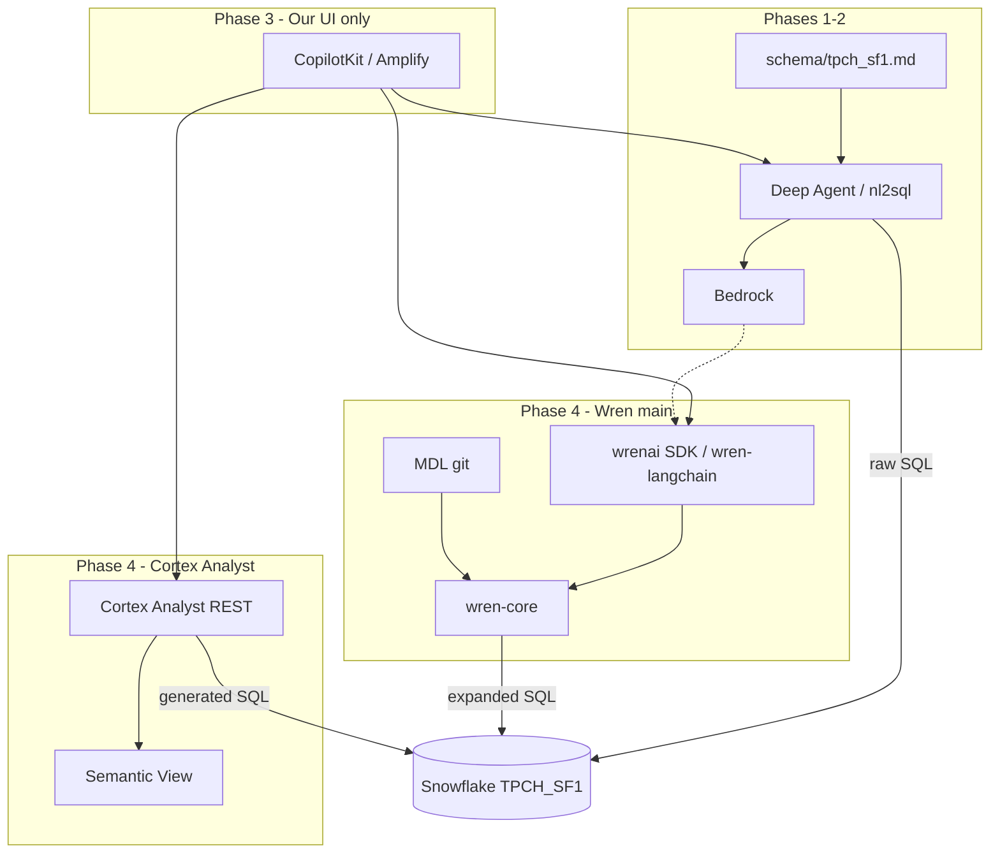

# Phase 4: Wren AI (main) + Cortex Analyst Comparison

## Overview

Phase 4 evaluates **governed NL→SQL** against two semantic approaches:

1. **Wren AI `main`** — OSS context layer (MDL + planner + memory), integrated via CLI/SDK/`wren-langchain` behind **our** agent/UI.
2. **Snowflake Cortex Analyst** — warehouse-native text-to-SQL over **Semantic Views**.

Phase 1/2 (Bedrock + prompt or Deep Agents) remain the **flexibility baseline**.

**Locked decisions (2026-06-01):**

| Decision | Choice |
|----------|--------|
| Wren codebase | **`Canner/WrenAI` `main` only** |
| Wren GenBI | **`legacy/v1` out of scope** — do not use Docker `wren-ui` or v1-final |
| Wren UI | **Not used** — profile setup via CLI is fine; all chat in Phase 3 / CopilotKit |
| User-facing UI | **Ours only** (Amplify / CopilotKit → Wren SDK or Cortex REST) |

Phase 4 is **evaluation-first**: TPCH semantics in both MDL and (where possible) a Semantic View, same question corpus, written recommendation for CTA.

---

## Problem Frame

| Layer | Phases 1–2 (today) | Wren `main` | Snowflake Cortex Analyst |
|-------|-------------------|-------------|---------------------------|
| Core bet | LLM + tools + prompt | MDL + planner + **your** LLM | Semantic View + **Snowflake** LLM |
| Schema | `schema/tpch_sf1.md` | `wren/tpch/**` MDL | Semantic View / YAML in Snowflake |
| SQL | Raw Snowflake SQL | SQL over models → expanded SQL | Analyst-generated SQL |
| LLM | Bedrock Nova | Bedrock (via agent) | Cortex (Claude/GPT/Arctic, auto-selected) |
| Execution | `nl2sql.run_sql` | Wren Snowflake connector | Runs in Snowflake |
| UI | Ours (Phase 3) | None (engine only) | Ours (REST client) |

Harness comparison (all options): [docs/architecture/nl2sql-harness-comparison.md](../architecture/nl2sql-harness-comparison.md)  
Wren vs Cortex deep dive: [docs/architecture/wren-vs-snowflake-cortex-analyst.md](../architecture/wren-vs-snowflake-cortex-analyst.md)

---

## What Wren `main` Is (2026)

In **May 2026**, Canner merged Wren Engine into `Canner/WrenAI` **`main`**. The old GenBI Docker app (`wren-ui`, port 3000) lives on **`legacy/v1`** — **we do not use it**.

**`main` is an agent-native open context layer:**

- **MDL** — models, relationships, metrics, instructions (git)
- **`wren-core`** — semantic SQL planning (DataFusion + sqlglot)
- **Memory** — LanceDB NL↔SQL recall (`wren memory`)
- **Interfaces** — `wren` CLI, `wrenai` Python SDK, `wren-langchain` tools, Cursor/Claude skills
- **No product chat UI** — only optional `wren profile add --ui` for connection setup

Wren does **not** replace Snowflake or dbt; it sits **between modeled data and agents** ([stack position](https://docs.getwren.ai/oss/concepts/stack_position)).

---

## Wren vs Cortex Analyst — When to use which

See the architecture note for full tables. Short version:

### Use **Cortex Analyst** when…

- Analytics are **Snowflake-only** and should stay in Snowflake’s governance boundary.
- You want **managed NL→SQL** (REST in, SQL out) with minimal agent infrastructure.
- **In-account LLMs** (Snowflake-hosted Claude, etc.) are acceptable instead of Bedrock.
- Cambria embeds one API; Semantic Views are the single semantic source of truth.

### Use **Wren `main`** when…

- **Bedrock** (or your chosen LLM) must stay the inference path.
- The product is a **Deep Agent** with tools, retries, and non-SQL work — Wren is the SQL/semantic engine.
- You need **git-reviewed MDL**, dry-plan visibility, and optional **multi-warehouse** semantics.
- You will **not** duplicate semantics: either MDL is primary, or you sync from Semantic Views deliberately.

### Use **neither alone** when…

- Markdown schema + Bedrock is “good enough” for the POC scope (join-heavy CTA questions may disagree).

### Avoid

- Maintaining **MDL and Semantic Views** with no sync — two truths for revenue, members, CES attendance, etc.
- Evaluating **`legacy/v1`** — wrong product generation for this repo.

---

## Requirements Trace

| ID | Requirement |
|----|-------------|
| R1 | TPCH modeled in **Wren MDL** (`wren/tpch/`) |
| R2 | TPCH modeled in **Snowflake Semantic View** (or legacy stage YAML if views blocked) |
| R3 | Same question corpus → score Phase 1/2, Wren, Cortex Analyst |
| R4 | Document harness winner + **no Wren UI / no v1** architecture |
| R5 | Katherine-ready comparison (accuracy, latency, governance, Bedrock fit) |
| R6 | CopilotKit **Off / Wren / Cortex** toggle — [005 plan](2026-06-01-005-feat-copilotkit-semantic-layer-toggle-plan.md) |

---

## Scope Boundaries

**In scope**

- `pip install "wrenai[snowflake,memory]"` — no `[main]` UI extra required if using CLI profile flags
- `wren/tpch/` MDL project
- Cortex Analyst REST spike against TPCH semantic object
- `scripts/compare_harnesses.py` (or split runners) — Wren + Cortex + existing baseline
- Architecture ADR updated with Cortex vs Wren outcome

**Out of scope**

- `legacy/v1`, `docker run wrenai/wrenai`, `wren-ui`
- Wren Cloud / enterprise GenBI SKU (unless CTA asks later)
- SuperSonic
- Production Cambria + Okta

### Deferred to Separate Tasks

- Full CTA semantic model (not TPCH)

### CopilotKit integration (in progress)

Phase 3 UI does **not** wait for harness winner. Implement a **three-way toggle** (Off / Wren / Cortex) per [2026-06-01-005 CopilotKit semantic layer toggle plan](2026-06-01-005-feat-copilotkit-semantic-layer-toggle-plan.md):

- **Off** — current Deep Agent + markdown schema
- **Wren** — MDL + Wren tools behind same CopilotKit chrome
- **Cortex** — Analyst REST when Semantic View is ready (UI option disabled until then)

---

## UI Strategy (resolved)

**Our UI only.** Wren contributes **engine + tools**, not chrome.

| Phase | Surface |
|-------|---------|
| Phase 4 eval | CLI (`wren`, compare scripts), optional Cursor with `wren-usage` skill |
| Phase 3 prod | CopilotKit/Amplify → FastAPI → `wren-langchain` **or** Cortex Analyst REST |

`wren profile add --ui` is acceptable **once** for Snowflake credential setup — not an end-user chat UI.

---

## Key Technical Decisions

| Decision | Choice | Rationale |
|----------|--------|-----------|
| Wren version | `main` OSS only | Matches 2026 direction; agent-composable |
| v1 / Wren UI | **Rejected** | User decision; avoids duplicate product UX |
| Comparison baseline | Add **Cortex Analyst** | Snowflake-native alternative to Wren, not only Deep Agents |
| LLM split | Wren path = Bedrock; Cortex path = Snowflake models | Honest comparison of real CTA constraints |
| MDL location | `wren/tpch/` | Git-native; mirrors `schema/tpch_sf1.md` |
| Semantic View | `TPCH_SF1` semantic view or stage YAML | Required for Analyst REST |
| Phase 1/2 | Keep until gate | Need three-way scores |

---

## High-Level Technical Design

---

## Implementation Units

- [ ] **Unit 1: Wren `main` spike (½ day)**

**Goal:** Install Wren OSS, Snowflake profile, one planned query — no v1.

**Requirements:** R1, R4

**Files:**
- Modify: `requirements.txt` (optional `wrenai[snowflake,memory]`)
- Create: `docs/plans/wren-phase4-spike-notes.md`

**Approach:**
- `pip install "wrenai[snowflake,memory]"`; `wren version`
- `wren profile add tpch-sf1 --interactive` (or `--from-file`) — **not** product UI dependency
- `wren profile debug`
- `wren --sql "SELECT COUNT(*) FROM ..."` smoke test
- Read [OSS quickstart](https://docs.getwren.ai/oss/get_started/quickstart), [architecture](https://docs.getwren.ai/oss/reference/architecture)

**Verification:** Snowflake TPCH reachable via Wren connector

---

- [ ] **Unit 2: TPCH MDL (1 day)**

**Goal:** Git-native semantic layer for Wren path.

**Requirements:** R1

**Files:**
- Create: `wren/tpch/wren_project.yml`, `wren/tpch/models/*/metadata.yml`, `wren/tpch/relationships.yml`, `wren/tpch/instructions.md`, `wren/tpch/queries.yml`
- Reference: `schema/tpch_sf1.md`

**Approach:** CUSTOMER, ORDERS, NATION (+ joins); `wren context build`; `wren memory index`; gitignore `wren/tpch/target/`

**Verification:** `wren dry-plan` / `wren dry-run` on join question

---

- [ ] **Unit 3: Cortex Analyst spike (½ day)**

**Goal:** Same TPCH semantics via Snowflake-native path.

**Requirements:** R2, R3

**Files:**
- Create: `semantic/tpch_semantic_view.yaml` (or Snowflake DDL from YAML)
- Create: `scripts/compare_cortex_analyst.py`
- Create: `docs/plans/cortex-analyst-spike-notes.md`

**Approach:**
- Define Semantic View over `SNOWFLAKE_SAMPLE_DATA.TPCH_SF1` tables (dimensions, relationships, 2–3 metrics, verified queries if supported)
- Enable Cortex Analyst + required model grants in sandbox account
- Call [Cortex Analyst REST API](https://docs.snowflake.com/en/user-guide/snowflake-cortex/cortex-analyst/rest-api) with `semantic_view` or `semantic_models`
- Record: SQL, latency, errors — **note LLM is Cortex, not Bedrock**

**Verification:** ≥3 TPCH questions return executable SQL

---

- [ ] **Unit 4: Three-way comparison harness (½ day)**

**Goal:** Scores for Phase 1/2, Wren, Cortex on shared corpus.

**Requirements:** R3, R5

**Files:**
- Create: `tests/questions/tpch_baseline.json`
- Create: `scripts/compare_harnesses.py` (flags: `--baseline`, `--wren`, `--cortex`)

**Verification:** Markdown/CSV artifact for Katherine; columns include harness, SQL, time, error, notes (Bedrock vs Cortex LLM)

---

- [ ] **Unit 5: Harness decision ADR (½ day)**

**Goal:** Close R4–R5 — Wren vs Cortex vs Deep Agents only.

**Requirements:** R4, R5

**Files:**
- Create: `docs/plans/2026-06-01-004-harness-decision-adr.md`
- Modify: `docs/plans/2026-05-29-003-feat-deep-agents-nl2sql-upgrade-plan.md` (link Phase 4; remove Wren deferral)

**Decision matrix (fill with scores):**

| Criterion | Weight | Phase 1/2 | Wren main | Cortex Analyst |
|-----------|--------|-----------|-----------|----------------|
| Accuracy on CTA-like joins | 30% | | | |
| Bedrock / AWS fit | 15% | | | |
| Snowflake governance | 15% | | | |
| Cambria embed effort | 15% | | | |
| Ops burden | 15% | | | |
| Agent flexibility | 10% | | | |

**Verification:** Explicit pick: Wren engine / Cortex Analyst / hybrid / stay on Deep Agents only

---

## What Changes If Wren Wins

| Today | Wren production path |
|-------|---------------------|
| `schema/tpch_sf1.md` | `wren/**` MDL (+ optional export from Semantic View) |
| Raw SQL in agent | `wren-langchain` tools + dry-plan |
| Phase 3 UI | Unchanged — still **our** UI |

## What Changes If Cortex Wins

| Today | Cortex production path |
|-------|------------------------|
| Prompt schema | Semantic Views in Snowflake |
| Bedrock for SQL | Cortex models for SQL; Bedrock optional for non-SQL agent |
| Phase 3 UI | REST client to Analyst |

---

## Risks & Dependencies

| Risk | Mitigation |
|------|------------|
| Cortex not enabled in sandbox | Early IT check; fallback to Semantic View DDL only |
| Duplicate semantics (MDL + Semantic View) | POC allows both for **comparison**; production picks one source of truth |
| Bedrock vs Cortex apples-to-oranges | Score separately on “SQL quality” vs “platform fit” |
| Analyst cost unknown | Log `CORTEX_ANALYST_USAGE_HISTORY` during spike |
| Old docs reference v1 Docker | Updated in meeting prep + requirements callout |

---

## Phased Delivery

| Sub-phase | Deliverable | Time |
|-----------|-------------|------|
| **4.0** | Wren main spike | 0.5 d |
| **4.1** | TPCH MDL | 1 d |
| **4.2** | Cortex Analyst spike | 0.5 d |
| **4.3** | Three-way compare | 0.5 d |
| **4.4** | Harness ADR | 0.5 d |

**Total:** ~3 days (no v1, no Wren UI work)

---

## Sources & References

- [NL→SQL harness comparison (this repo)](../architecture/nl2sql-harness-comparison.md)
- [Wren vs Cortex Analyst (this repo)](../architecture/wren-vs-snowflake-cortex-analyst.md)
- [WrenAI `main`](https://github.com/Canner/WrenAI) — **not** [`legacy/v1`](https://github.com/Canner/WrenAI/tree/legacy/v1)
- [Wren OSS architecture](https://docs.getwren.ai/oss/reference/architecture)
- [Cortex Analyst](https://docs.snowflake.com/en/user-guide/snowflake-cortex/cortex-analyst)
- [Semantic Views](https://docs.snowflake.com/en/user-guide/views-semantic/semantic-view-yaml-spec)
- [Cortex Analyst REST API](https://docs.snowflake.com/en/user-guide/snowflake-cortex/cortex-analyst/rest-api)

---

## Bottom Line

- **Wren `main`** = semantic **engine** for **your** Bedrock agent and **your** UI — not a chat product.
- **Cortex Analyst** = Snowflake’s managed NL→SQL — strongest when Snowflake-only governance beats Bedrock-for-SQL.
- Phase 4 must **benchmark both**; choosing Wren without scoring Cortex Analyst leaves the main warehouse-native option unexplored.
