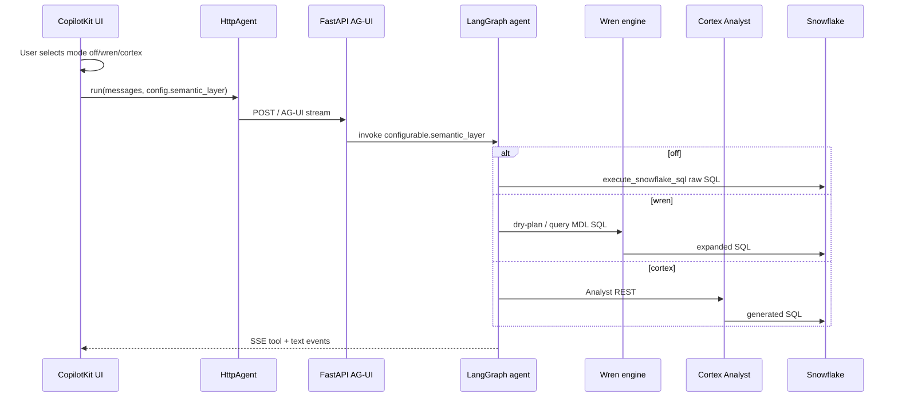

# CopilotKit semantic layer toggle (Wren / Cortex / Off)

## Overview

Add a **user-controlled semantic layer mode** to the existing CopilotKit UI. The Deep Agent + Bedrock stack stays the orchestrator; semantics are **pluggable** and **mutually exclusive**:

| Mode | Behavior |
|------|----------|
| **`off`** | Today’s behavior — `get_schema_summary` + markdown-backed prompt, raw Snowflake SQL |
| **`wren`** | Wren `main` MDL + planner tools (`wren-langchain` or thin SDK wrappers) |
| **`cortex`** | Cortex Analyst REST over a Snowflake Semantic View (stub until Phase 4 Unit 3 lands) |

**Not in scope:** Wren product UI, `legacy/v1`, running Wren and Cortex semantics **at the same time** on one question.

**UI:** Segmented control in the app header (not a hidden env flag). **Backend:** Mode travels with each AG-UI run so the same server serves all modes.

---

## Problem Frame

CopilotKit today (`ui/src/App.tsx` → `HttpAgent` → `api/main.py` → `build_agent_graph()`) builds **one** graph at startup with fixed tools and prompt (`src/agent_factory.py`). There is no way to:

- Try Wren without forking the app
- Later A/B Cortex vs Wren from the same chat chrome
- Turn semantics off when debugging prompt-only behavior

The toggle is a **product control** and an **architecture seam**: one agent runtime, three semantic backends.

(see [nl2sql harness comparison](../architecture/nl2sql-harness-comparison.md) — orchestration vs semantics)

---

## Requirements Trace

| ID | Requirement |
|----|-------------|
| R1 | UI control: **Off / Wren / Cortex** (radio or segmented; exactly one active) |
| R2 | Mode sent to API on each agent run (not only at page load) |
| R3 | **`off`**: unchanged tools — `get_schema_summary`, `execute_snowflake_sql` |
| R4 | **`wren`**: Wren tools active; baseline schema tool de-emphasized or skipped per prompt |
| R5 | **`cortex`**: Cortex tool active when configured; graceful message if not set up |
| R6 | **Mutual exclusion** — never invoke Wren planner and Cortex Analyst for the same turn |
| R7 | Status endpoint reports available modes (e.g. `cortex: false` until Semantic View exists) |
| R8 | Switching mode mid-session: documented behavior (recommend new thread / “clear chat”) |

---

## Scope Boundaries

**In scope**

- `SemanticLayerMode` type and shared config module
- Wren MDL project `wren/tpch/` (prerequisite from Phase 4)
- Wren tools wired into `agent_factory`
- API + AG-UI config pass-through (spike first)
- CopilotKit header toggle + persistence (`localStorage`)
- Cortex tool **stub** + enable flag when Semantic View + credentials ready

**Out of scope**

- Sync pipeline MDL ↔ Semantic View (pick one as source of truth later)
- Per-user mode in Okta (dev toggle only for POC)
- Separate FastAPI apps per harness

### Deferred to Separate Tasks

- Production feature flag service (LaunchDarkly, etc.)
- Analyst billing / cost caps in UI

---

## Key Technical Decisions

| Decision | Choice | Rationale |
|----------|--------|-----------|
| Mode values | `"off" \| "wren" \| "cortex"` | Mutually exclusive semantics; avoids dual-layer answers |
| Default mode | `off` | Safe baseline; matches current production behavior |
| Graph strategy | **One graph**, tool set + system prompt vary by `configurable.semantic_layer` | Single AG-UI agent id; no server restart on toggle |
| Wren integration | `wren-langchain` tools if stable; else subprocess/SDK wrappers in `src/tools/wren_tools.py` | Aligns with Phase 4 |
| Cortex integration | One tool: `ask_cortex_analyst(question)` → REST | Keeps Analyst black-box inside one tool |
| Config transport | Prefer AG-UI run `config` / `forwardedProps`; fallback custom header `X-Semantic-Layer` | Verify in Unit 1 spike against `ag-ui-langgraph` version in repo |
| Mid-chat mode change | New `thread_id` when mode changes (UI prompts or auto-rotates) | Avoids tool/prompt mismatch in same LangGraph thread |
| Cortex UI option | Disabled + tooltip until `/api/status` reports `cortex_ready: true` | Clear UX before Semantic View exists |

---

## High-Level Technical Design

> *Directional guidance for review, not implementation specification.*



### Mode → tools → prompt (single graph)

| Mode | Tools (in addition to shared) | System prompt emphasis |
|------|------------------------------|-------------------------|
| `off` | `get_schema_summary`, `execute_snowflake_sql` | Current `SYSTEM_PROMPT` |
| `wren` | `wren_dry_plan`, `wren_query` (names TBD), optional `wren_memory_fetch` | Write SQL against **MDL model names**; call Wren before raw execute |
| `cortex` | `ask_cortex_analyst` | Prefer Analyst for SQL; show returned SQL to user |

**Tool gating:** Implement with LangGraph `configurable` + bind tools dynamically, **or** register all tools and add guard in docstring + first line (“only use when semantic_layer=wren”). Prefer **dynamic tool list** via factory called per-run if `ag-ui-langgraph` supports it; otherwise guards for POC.

---

## Target file layout

```text
src/
  semantic_layer/
    __init__.py
    types.py              # SemanticLayerMode Literal
    prompts.py              # system prompt per mode
  tools/
    snowflake_tools.py      # existing
    wren_tools.py           # new
    cortex_tools.py         # new (stub → real)
  agent_factory.py          # build_agent_graph(), mode-aware tools + prompt
api/
  main.py                   # status fields; config pass-through hook
ui/src/
  components/
    SemanticLayerToggle.tsx # new
  hooks/
    useSemanticLayerMode.ts # localStorage + state
  App.tsx                   # header toggle; pass mode into HttpAgent
  config.ts                 # types, defaults
wren/tpch/                  # MDL project (Phase 4)
semantic/                   # Cortex Semantic View YAML (Phase 4)
```

---

## Implementation Units

- [x] **Unit 1: AG-UI config spike (2–4 hours)** — `forwardedProps.semanticLayer` + `SemanticLayerLangGraphAgent`

**Goal:** Prove `semantic_layer` reaches `graph.invoke(..., config={"configurable": {...}})`.

**Files:** `api/main.py`, notes in `docs/plans/wren-phase4-spike-notes.md`

**Approach:**
- Log incoming AG-UI run payload on one chat message
- If library supports `forwardedProps` / `config`, thread into `LangGraphAgent`
- If not: FastAPI middleware reads `X-Semantic-Layer` header from `HttpAgent` custom `fetch`

**Verification:** Log line shows `semantic_layer=wren` when UI sends it

---

- [x] **Unit 2: Semantic layer module + agent factory refactor (½ day)**

**Goal:** Centralize mode type, prompts, and tool lists.

**Files:**
- Create: `src/semantic_layer/types.py`, `src/semantic_layer/prompts.py`
- Modify: `src/agent_factory.py`

**Approach:**
- `SemanticLayerMode = Literal["off", "wren", "cortex"]`
- `get_system_prompt(mode)`, `get_tools(mode)`
- `build_agent_graph()` unchanged signature for API startup **or** accept optional default mode
- Export `DEFAULT_SEMANTIC_LAYER = "off"`

**Test scenarios:**
- `get_tools("off")` returns only snowflake tools
- `get_tools("wren")` includes wren tools, not cortex
- `get_tools("cortex")` includes cortex tool only

**Verification:** Unit test or small `scripts/py -c` import check

---

- [x] **Unit 3: Wren MDL + tools (1 day)** — scaffold + CLI tools; run `wren context build` locally to enable

**Goal:** Wren path works from Python when mode=`wren`.

**Dependencies:** Phase 4 Unit 1–2 (`wren/tpch/`, `wrenai[snowflake,memory]`)

**Files:**
- Create: `wren/tpch/**`, `src/tools/wren_tools.py`
- Modify: `requirements.txt`

**Approach:**
- Bind Wren project root via env `WREN_PROJECT_DIR=wren/tpch` or discover from repo root
- Tools (illustrative names):
  - `wren_dry_plan(sql: str)` → expanded SQL string
  - `wren_run_sql(sql: str)` → rows (SQL references MDL models)
  - Optional: `wren_memory_fetch(question: str)` for context
- Use `wren-langchain` if version matches repo; else call `wrenai` SDK

**Test scenarios:**
- Happy path: `wren_run_sql` on a join question returns rows
- Error path: invalid model name → error text agent can read

**Verification:** CLI script `scripts/py src/tools/wren_tools.py` smoke test (optional)

---

- [x] **Unit 4: API status + config wiring (½ day)**

**Goal:** Backend exposes mode readiness; graph receives per-run mode.

**Files:**
- Modify: `api/main.py`, `src/agent_factory.py`

**Approach:**
- Extend `GET /api/status`:
  ```json
  {
    "status": "ok",
    "semantic_layer": {
      "default": "off",
      "wren_ready": true,
      "cortex_ready": false
    }
  }
  ```
- `wren_ready`: `wren profile debug` equivalent or check `target/mdl.json` exists
- `cortex_ready`: env `CORTEX_SEMANTIC_VIEW` set + optional ping
- Wire Unit 1 spike into graph invocation

**Verification:** `curl /api/status` reflects Wren; chat run uses configured mode

---

- [x] **Unit 5: CopilotKit UI toggle (½ day)**

**Goal:** User switches Off / Wren / Cortex in header; mode sent on each run.

**Files:**
- Create: `ui/src/components/SemanticLayerToggle.tsx`, `ui/src/hooks/useSemanticLayerMode.ts`
- Modify: `ui/src/App.tsx`, `ui/src/App.css`, `ui/src/config.ts`

**Approach:**
- Segmented control: **Off | Wren | Cortex**
- Persist `semanticLayerMode` in `localStorage`
- Fetch `/api/status` on load; disable **Cortex** segment when `cortex_ready === false` (tooltip: “Semantic View not configured”)
- Pass mode into `HttpAgent`:
  - Preferred: `config` / `forwardedProps` per Unit 1
  - Fallback: custom header on `fetch` wrapper
- Header pill: `Semantics: Off` (or Wren / Cortex)
- On mode change while chat has messages: confirm “Start new conversation?” → new `threadId` if CopilotKit exposes it, or document “refresh page”

**Test scenarios:**
- Happy path: select Wren → ask question → backend log shows `wren`
- Happy path: select Off → behavior matches pre-toggle
- Edge case: Cortex disabled in UI when not ready

**Verification:** Manual test with API logs + one Wren question

---

- [x] **Unit 6: Cortex tool stub + enable path (½ day, after Semantic View)** — placeholder only; UI segment disabled

**Goal:** Third mode works when Snowflake Semantic View exists.

**Files:**
- Create: `src/tools/cortex_tools.py`, `semantic/tpch_semantic_view.yaml`
- Modify: `src/semantic_layer/prompts.py`, `api/main.py` status check

**Approach:**
- Env: `CORTEX_SEMANTIC_VIEW=DB.SCHEMA.VIEW`, Snowflake JWT/session same as existing connector
- `ask_cortex_analyst(question: str)` → calls REST, returns `{sql, answer_text, error?}`
- Stub initially: returns clear “not configured” if env missing
- When ready: set `cortex_ready: true`; enable UI segment

**Verification:** One TPCH question via Cortex mode returns SQL + rows in chat

---

- [ ] **Unit 7: Docs + operator notes (1 hour)**

**Goal:** Repo docs match behavior.

**Files:**
- Modify: `docs/architecture/nl2sql-harness-comparison.md` (add “CopilotKit toggle” section)
- Modify: `docs/plans/2026-06-01-004-feat-wren-ai-phase-4-plan.md` (link this plan as Phase 3/4 integration)
- Modify: `api/README.md`, `README.md`

**Verification:** New contributor can read how to run UI with Wren on

---

## Recommended order

| Step | Units | Notes |
|------|-------|-------|
| 1 | Unit 1 | Unblocks UI↔API contract |
| 2 | Unit 2 + 3 | Wren without UI |
| 3 | Unit 4 + 5 | End-to-end Off ↔ Wren in CopilotKit |
| 4 | Unit 6 | Cortex when Semantic View ready |
| 5 | Unit 7 | Docs |

**Parallel:** Phase 4 TPCH MDL (Unit 3) overlaps with Phase 4 plan Units 2–3.

---

## System-Wide Impact

- **Interaction graph:** Only `agent_factory`, new tools, `api/main.py`, `ui` header — no change to `nl2sql.py` CLI unless you add `--semantic-layer` later
- **Error propagation:** Wren/Cortex errors must return agent-readable strings (same as Snowflake tool today)
- **Security:** Mode is client-selected in POC — acceptable for dev; production should validate server-side allowlist
- **Unchanged:** CopilotKit runtime stub (`/copilotkit`), `HttpAgent` URL, Bedrock model id

---

## Risks & Dependencies

| Risk | Mitigation |
|------|------------|
| AG-UI does not forward config | Header fallback; contribute upstream or wrap `LangGraphAgent` |
| Tool sprawl (all modes registered) | Dynamic tools or strict prompt + guard |
| User toggles mid-thread | Force new thread on mode change |
| Wren not installed | `wren_ready: false`; disable Wren segment |
| Dual semantics temptation | UI is radio, not two checkboxes; code asserts single mode |

---

## Success Metrics

- [ ] Off mode behavior matches pre-toggle baseline
- [ ] Wren mode answers a join question using MDL model names
- [ ] Cortex segment disabled until `cortex_ready`
- [ ] One documented path to run: API + UI + Wren on

---

## Sources

- [Phase 4 Wren + Cortex plan](2026-06-01-004-feat-wren-ai-phase-4-plan.md)
- [NL→SQL harness comparison](../architecture/nl2sql-harness-comparison.md)
- [CopilotKit local UI learnings](../solutions/copilotkit-local-ui-learnings.md)
- Repo: `ui/src/App.tsx`, `api/main.py`, `src/agent_factory.py`
