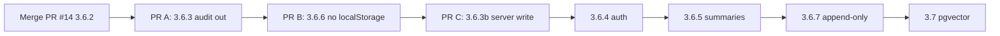

# Memory architecture roadmap — CopilotKit POC

## Target architecture

One mental model for the whole app:

```
┌──────────────────────────────────────────────────────────────────┐
│  COPILOTKIT UI (self-hosted HttpAgent)                           │
│  • thread_id per request (HttpAgent fetch hook)                  │
│  • restore transcript from GET /api/sessions/{id}/messages       │
│  • no CopilotKit threadId; no audit/localStorage for chat UX     │
└────────────────────────────┬─────────────────────────────────────┘
                             │
┌────────────────────────────▼─────────────────────────────────────┐
│  POSTGRES (one DB)                                                 │
│  • checkpoints      → short-term / working (LangGraph)             │
│  • conversations    → episodic metadata (sidebar)                │
│  • messages         → episodic transcript (UI + optional agent)  │
│  • [future] semantic_examples + pgvector → semantic NL↔SQL recall  │
└────────────────────────────┬─────────────────────────────────────┘
                             │
┌────────────────────────────▼─────────────────────────────────────┐
│  S3 audit → Audit log page ONLY (compliance, not chat restore)     │
└──────────────────────────────────────────────────────────────────┘

Separate (Wren mode today):
  wren/tpch/target/ → Wren LanceDB memory (semantic collection)
  Replace later with pgvector table in same Postgres (optional)
```

| Memory type | Purpose | Store | CopilotKit touchpoint |
|-------------|---------|-------|------------------------|
| **Short-term** | Follow-ups in this thread | LangGraph checkpointer | `thread_id` on AG-UI runs |
| **Episodic** | Chat history UX | Postgres `messages` | `ChatPane` restore; sidebar |
| **Semantic** | Similar past SQL / facts | Wren memory → pgvector | Agent tool at plan time |
| **Procedural** | How the SQL agent behaves | Prompts, `AGENTS.md`, mode | System prompt; not user chat |
| **Audit** | Proof / debug | S3 | Audit logs **page** only |

Reference: [LangMem conceptual guide](https://langchain-ai.github.io/langmem/concepts/conceptual_guide/) · [Deep Agents MemoryMiddleware](https://reference.langchain.com/python/deepagents/middleware/memory) (procedural / AGENTS.md — applies to repo agent instructions, not end-user chat DB).

---

## CopilotKit integration principles (keep forever)

These survived PR #11 and 3.6.2 — do not regress:

1. **No `threadId` on `<CopilotKit>`** — use `HttpAgent` fetch hook for `thread_id`.
2. **Single `useSqlAgent()`** — one agent handle; no duplicate `connectAgent` clears.
3. **Flush before session switch** — `ActiveThreadFlushBridge` → persist outgoing thread.
4. **Explicit restore** — `agent.setMessages()` after `GET /api/sessions/{id}/messages`.
5. **Self-hosted** — no Copilot Cloud thread store; Postgres is our thread store.

---

## Phase status

| Step | Status | Notes |
|------|--------|-------|
| **3.6.1** LangGraph Postgres checkpointer | ✅ Code | Ops: Docker + `DATABASE_URL` + restart API |
| **3.6.2** Sessions + messages API | ✅ PR #14 | Replace-all PUT (POC) |
| **3.6.3** Audit decoupled from chat UX | ✅ Done | Chat restore/sidebar Postgres-only |
| **3.6.6** Postgres-only chat path | ✅ Done | One-time localStorage migration; no dual writer |
| **3.6.3b** Server-side message write | ✅ Done | `append_run_turn` after each agent run |
| **3.6.4** User scoping | 📋 | `user_id` on all session rows |
| **3.6.5** Context window / summaries | 📋 | Long threads |
| **3.6.7** Append-only message writes | 📋 Pre-prod | Replace replace-all PUT |
| **3.7** Semantic memory (pgvector) | 📋 Long-term | Optional Wren memory replacement |
| **3.8** LangMem-style extraction | 📋 Optional | Profiles/collections from chat (not required for MVP) |

---

## Short term (next 2–3 PRs)

### PR A — 3.6.3: Audit out of chat UX

**Goal:** Chat never reads S3 for sidebar or restore.

| Change | Files (indicative) |
|--------|-------------------|
| Remove audit fallback from `resolveThreadMessages` | `ui/src/lib/resolveThreadMessages.ts` |
| Remove audit fallback from `useChatSessions` | `ui/src/hooks/useChatSessions.ts` |
| Show clear empty state when Postgres empty | `ChatHistoryList`, status banner |
| Run audit backfill once | `scripts/backfill_chat_sessions_from_audit.py` |
| Docs: audit = Audit page only | architecture + learnings |

**Acceptance:** With Postgres up, sidebar and restore work with zero calls to `/api/audit/sessions` or audit message rebuild. Audit page unchanged.

**Risk:** Old threads only in audit disappear from chat — mitigated by backfill script + one-time localStorage backfill (already in UI startup).

---

### PR B — 3.6.6: Postgres-only chat path

**Goal:** No localStorage for chat authority.

| Change | Files |
|--------|-------|
| Stop reading `ai-sql-poc-chat-snapshots` on restore | `resolveThreadMessages.ts` |
| Optional: keep write-through cache after successful PUT only, or delete keys entirely | `chatPersistence.ts` |
| Remove startup localStorage backfill (or run once then delete keys) | `App.tsx`, `sessionApi.ts` |
| Fail visibly if `sessions.available: false` | header / chat empty state |

**Acceptance:** Clear browser storage → history still loads from Postgres. No dual-writer drift.

**Order:** After 3.6.3 (your preference). Do not start until backfill confirmed in dev.

---

### PR C — 3.6.3b: Server-side transcript write

**Goal:** Postgres gets messages even if UI flush fails or user closes tab mid-stream.

| Change | Files |
|--------|-------|
| After successful agent run, append user question + assistant summary to `messages` | `src/ag_ui_agent.py` or audit hook |
| Reuse audit extract shape for assistant text (POC) | `chat_sessions/store.py` — add `append_messages` |
| UI PUT remains for rich transcript; server append is safety net | both paths |

**Acceptance:** Send message → kill browser before flush → reload → messages still in Postgres from server write.

This completes the spirit of old **3.6.3** (“write messages to DB on each turn”) without waiting on perfect UI serialization.

---

## Medium term (MVP-shaped)

### 3.6.4 — User / tenant scoping

- Auth stub → real SSO; `user_id` on `conversations` (replace `'local'`).
- All session API queries filter by `user_id`.
- CopilotKit unchanged; identity from cookie/header on API.

### 3.6.5 — Context window strategy

- **Short-term:** pass last N messages + checkpoint to model.
- **Episodic compression:** background job writes thread summary row; inject summary instead of full history.
- LangMem “subconscious formation” pattern — summarize after idle, not on every token.

### 3.6.7 — Append-only writes (pre-production)

- `POST /api/sessions/{id}/messages` with `{ id, role, content }` per new message.
- Deprecate replace-all PUT except admin/backfill tools.
- Documented in [3.6.2 plan § Before production](./2026-06-01-007-feat-postgres-sessions-api-plan.md#before-production--change-these-poc-shortcuts).

### Editor agent sessions

- Add `kind` column: `chat` | `semantic_editor` (or separate table).
- Port `useEditorSessions` off audit same as SQL chat (3.6.3 pattern).

### Background runs while switched away

- Per-thread message store in React context OR server streaming to Postgres only.
- Session switch does not cancel run; restore picks up completed messages from API.

---

## Long term (production / CTA-aligned)

### 3.7 — Semantic memory in Postgres (pgvector)

**Not chat history.** Verified NL↔SQL example table + embeddings.

1. Enable `pgvector` extension in compose Postgres.
2. Table `semantic_examples (id, question, sql, embedding, semantic_layer, verified_at)`.
3. On successful audited run (optional human flag), insert example.
4. New tool `search_similar_sql` replaces or supplements `wren_memory_fetch`.
5. Deprecate Wren LanceDB when Wren mode retired or hybrid during transition.

See [query-and-memory-storage.md § pgvector](../architecture/query-and-memory-storage.md#future-postgres--pgvector-optional-replacement-for-wren-memory).

### 3.8 — LangMem-style long-term memory (optional)

Only if product needs **cross-thread** user preferences or org facts:

- **Profile:** one row per user (preferred name, default semantic mode).
- **Collection:** searchable facts with LangMem-style extract/consolidate in background.

Keep separate from `messages` — do not vector-search raw chat for sidebar.

### Procedural memory

- SQL agent: prompts in `agent_factory.py` + mode-specific tools (already procedural).
- Repo agents: `AGENTS.md` (Deep Agents MemoryMiddleware pattern) — unrelated to user Postgres.

### Deploy

- Managed Postgres (Aurora) + same schema.
- S3 audit unchanged.
- CopilotKit UI + FastAPI; no Copilot Cloud thread sync.

---

## What we are NOT doing

| Avoid | Why |
|-------|-----|
| CopilotKit Cloud / `useThreads` premium | Self-hosted POC |
| Audit as chat fallback after 3.6.3 | Wrong shape, wrong job |
| Storing chat in S3 for UX | Compliance only |
| One Postgres table for everything | Checkpoints ≠ messages ≠ embeddings |
| LangMem hot-path extraction on every message | Latency; use background jobs if ever |

---

## Recommended PR sequence



---

## Success metrics

| Milestone | Signal |
|-----------|--------|
| 3.6.3 done | Network tab: chat load has no `/api/audit/sessions` |
| 3.6.6 done | Cleared localStorage; history intact |
| 3.6.3b done | Server write without UI flush |
| MVP | Postgres + S3 audit page only; Docker required for chat |
| Long-term | Optional pgvector; Wren memory optional |

---

## Doc maintenance

When completing each step, update:

- `docs/architecture/chat-memory-and-sessions.md`
- `docs/architecture/query-and-memory-storage.md`
- `docs/solutions/chat-memory-and-session-learnings.md`
- Phase 3.6 table in `docs/plans/2026-05-29-004-feat-copilotkit-local-ui-plan.md`
