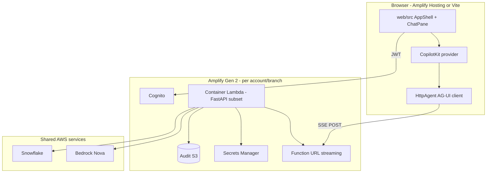

# Port CopilotKit UI to Amplify Gen 2 (multi-client portable)

## Overview

Replace the default Amplify Vite starter in `web/` with the **production-quality CopilotKit experience** already built in `ui/` + `api/`, and package the result so a **future mission** can deploy the same codebase into **another client AWS account** with only profile, secrets, and `amplify_outputs.json` changes.

**Mission intent:** This document is the single source of truth for an automated or human **implementation run** later. It does not prescribe shell choreography; it defines decisions, boundaries, units, and verification outcomes.

**Current state (June 2026):** CDK bootstrap in account `654654461736` / `us-east-1` is unblocked; `npx ampx sandbox` deploys Cognito + AppSync Todo scaffold. The React app is still the create-amplify template — not wired to `amplify_outputs.json` or NL→SQL.

---

## Problem Frame

| Track | Location | Role today |
|-------|----------|------------|
| **CopilotKit (active)** | `ui/` + `api/` + `src/` | Full NL→SQL chat, semantic layer toggle, audit logs, semantic editor, session history |
| **Amplify Gen 2 (parked → now viable)** | `web/` | Vite host + `amplify/` backend (auth + default Todo data model) |

The team invested in CopilotKit because Amplify sandbox was blocked. With CDK access restored, the goal is **feature parity where it matters for demos**, not a literal copy of every dev-only affordance (Postgres Docker hints, local `logs/audit`, Wren CLI on laptop).

**Portable client deploy** means:

- No hardcoded account IDs, bucket names, or SSO profile names in application source
- Secrets and env via Amplify **`secret()`** and branch-scoped hosting vars — not committed `.env`
- Per-client deploy documented as a **checklist + manifest**, not a fork of the repo
- Gen 2 **branch = environment**; cross-account production follows [Amplify cross-account deployments](https://docs.amplify.aws/react/deploy-and-host/fullstack-branching/cross-account-deployments/)

---

## Requirements Trace

- **R1.** Browser UI matches CopilotKit layout: left nav (chat history, views), main chat, optional right context rail, status badges.
- **R2.** NL→SQL agent behavior reuses `src/` logic (Bedrock Nova + Snowflake + tools), not a greenfield Lambda rewrite of prompts.
- **R3.** `web/` remains the Amplify Gen 2 root (`ampx sandbox`, `pipeline-deploy`); do not move Amplify into `ui/`.
- **R4.** A new AWS account can host the app after: CDK bootstrap, Amplify secrets, Snowflake secret, Bedrock access, and `npx ampx pipeline-deploy` / sandbox — documented in `deploy/clients/README.md`.
- **R5.** Local dev path stays viable: Vite + sandbox (or Vite pointing at deployed Function URL).
- **R6.** Document deliberate **non-goals** for v1 Amplify (see Scope Boundaries).

---

## Scope Boundaries

**In scope (v1 Amplify mission)**

- Port **App shell**, **Chat**, **Audit logs** (read-only against S3 or hybrid API), **session list**, **semantic layer toggle** (Off + Wren if Wren artifacts bundled), **tool result cards** (SQL, chart, Wren dry-plan).
- Amplify **Auth** (email) gating the SPA.
- Backend: **query agent** compute (see Key Technical Decisions) + **status** + **audit read** endpoints.
- **Client deploy kit**: manifest template, secrets list, IAM checklist, bootstrap notes.
- Remove default **Todo** demo model from user-facing UI (backend Todo stack may remain until data model is replaced).

**Non-goals (v1)**

- Full **semantic layer editor** (file tree, GitHub PR, second editor agent) — keep in `ui/` until Lambda/container story supports Wren CLI and GitHub token (see Deferred).
- **Cortex** semantic mode — stub only until Semantic View config exists.
- **CopilotKit runtime** at `/copilotkit` on Lambda unless a thin Node stub is trivial; prefer one AG-UI streaming surface.
- Parity with **Postgres Docker** dev hint in production UI.

### Deferred to Separate Tasks

- **Semantic editor parity** (`ui/` third view): separate plan/PR after query agent is stable on Lambda/container — depends on Wren in Lambda or sidecar.
- **Amplify AI Kit** (`Conversation` models): evaluate only if AG-UI port proves too heavy; different protocol from current LangGraph agent.
- **Monorepo extract** (`packages/shared-ui`): optional refactor after first copy into `web/src` works.

---

## Context & Research

### Relevant Code and Patterns

| CopilotKit area | Primary files | Amplify target |
|-----------------|---------------|----------------|
| App bootstrap | `ui/src/App.tsx`, `ui/src/config.ts` | `web/src/App.tsx`, `web/src/config.ts` |
| Layout / views | `ui/src/components/AppShell.tsx`, `LeftSidebar.tsx` | Same structure under `web/src/components/` |
| Chat | `ui/src/components/ChatPane.tsx`, `SessionPanel.tsx` | Port; wire agent URL from env |
| AG-UI client | `ui/src/lib/httpAgent.ts`, `editorHttpAgent.ts` | `web/src/lib/httpAgent.ts` — base URL from `VITE_API_URL` or outputs |
| Tool UI | `ui/src/components/CopilotToolRenderers.tsx`, `SqlToolResultCard.tsx`, `SqlResultChart.tsx`, `WrenDryPlanCard.tsx` | Port CSS + components |
| Sessions | `ui/src/hooks/useChatSessions.ts`, `useActiveThreadPersistence.ts`, `chatPersistence.ts` | Backed by audit API or new DynamoDB table |
| Audit | `ui/src/components/AuditLogsPage.tsx`, `api/main.py` audit routes | Lambda + S3 read (reuse `src/audit_reader.py`) |
| Semantic toggle | `ui/src/components/SemanticLayerToggle.tsx`, `api/main.py` forwardedProps | Pass through AG-UI body on agent runs |
| FastAPI agent | `api/main.py`, `src/ag_ui_agent.py`, `src/agent_factory.py` | Lambda handler or container entry |
| Amplify scaffold | `web/amplify/backend.ts`, `auth/resource.ts`, `data/resource.ts` | Extend `backend.ts` with functions + optional REST |

**Dual-endpoint pattern (keep):** CopilotKit `runtimeUrl` is for sync only; chat uses `HttpAgent` → AG-UI SSE. See `docs/solutions/copilotkit-local-ui-learnings.md`.

### Institutional Learnings

- **CopilotKit + AG-UI:** Do not point `runtimeUrl` at the LangGraph path; stub `/copilotkit` or drop CopilotKit provider if custom chat UI is used (`docs/solutions/copilotkit-local-ui-learnings.md`).
- **Sessions / undefined.length:** Always default `sessions = []`; guard `messages?.length` (`docs/solutions/chat-memory-and-session-learnings.md`, `AGENTS.md`).
- **CDK bootstrap:** Was blocked; refresh `docs/solutions/aws-amplify-cdk-bootstrap-blocked.md` to `resolved` when mission completes bootstrap in a second account.
- **Phase 3 split:** `ui/` + `api/` stay the **reference implementation** until `web/` reaches parity; avoid editing `ui/` for Amplify-only hacks.

### External References (AWS / Amplify)

- [Amplify Gen 2 sandbox](https://docs.amplify.aws/react/deploy-and-host/sandbox-environments/setup/) — per-developer stack, writes `amplify_outputs.json`.
- [Gen 2 functions (Python supported)](https://docs.amplify.aws/react/build-a-backend/functions/custom-functions/) — prefer `defineFunction` for Node; **Python Deep Agent** likely needs **container image** or custom function (Docker bundling not default on Git pipelines).
- [Environment variables and secrets](https://docs.amplify.aws/react/build-a-backend/functions/environment-variables-and-secrets/) — use `secret('SNOWFLAKE')`, never plaintext secrets in `environment`.
- [Cross-account deployments](https://docs.amplify.aws/react/deploy-and-host/fullstack-branching/cross-account-deployments/) — `ampx pipeline-deploy` per account/branch, `ampx generate outputs` for frontend.
- [Lambda response streaming](https://docs.aws.amazon.com/lambda/latest/dg/configuration-response-streaming.html) — required for AG-UI SSE; Python via **Lambda Web Adapter** or Node proxy (research during Unit 2 spike).

---

## Suggested Improvements (Current UI / Backend)

Use this section during the mission as **acceptance extras** where cheap; not all are blocking v1.

### UI

| Area | Current gap | Suggested improvement |
|------|-------------|------------------------|
| Chat results | Tool cards exist; some panels were placeholder-era | Ensure every tool emits structured payload for `SqlToolResultCard` + export CSV |
| Loading / errors | API badge only | Global toast or inline banner when agent stream fails mid-run; retry button |
| Auth | None on localhost | Cognito sign-in/up in `web/`; hide chat until session valid |
| Sample questions | `SAMPLE_QUESTIONS` in config | Render chips above composer on empty thread |
| Mobile | Desktop-first `AppShell` | Collapse sidebars; single-column chat for hosted demo |
| Accessibility | Custom markdown renderers | Audit focus order on sidebar + chat input |
| Editor view | Rich in `ui/`, absent in Amplify v1 | Link out to “use local editor” doc instead of half-port |

### Backend

| Area | Current gap | Suggested improvement |
|------|-------------|------------------------|
| Checkpoints | Postgres optional locally; MemorySaver fallback | **Aurora/RDS Postgres** via `DATABASE_URL` on Lambda (same as `src/checkpoint_factory.py`) |
| Audit | Local JSONL + optional S3 | **Amplify v1:** S3-only audit in cloud; drop local dir in Lambda |
| Timeouts | Long Snowflake + Bedrock runs | Lambda 15 min max (container); API Gateway 29s if not using Function URL streaming |
| Semantic modes | Cortex stub | Clear UI when `cortex_ready: false`; hide mode vs disable with tooltip |
| Wren in cloud | CLI + local profiles | Bundle `wren/tpch` in deployment artifact; or disable Wren mode in cloud manifest |
| Status endpoint | Rich payload | Split `GET /api/status` into public vs authenticated fields |
| Cold start | N/A local | Provisioned concurrency on query Lambda for demos |
| Security | Dev CORS wide open | Restrict origins to Amplify Hosting domain per branch |

---

## Key Technical Decisions

### D1. UI port strategy: **copy-then-shared**

**Decision:** Copy `ui/src` components into `web/src` in the first mission; extract shared package only if duplication hurts.

**Rationale:** `ui/` and `web/` have different env vars (`VITE_*` vs `amplify_outputs`). Faster mission; refactor later.

### D2. Agent compute: **container Lambda + Function URL (recommended)**

**Decision:** Package `api/main.py` AG-UI routes (at minimum `POST /` for `nl2sql_assistant`) as a **container-based Lambda** with **response streaming** enabled, fronted by Function URL. Add Mangum or Lambda Web Adapter for ASGI.

**Alternatives considered:**

| Approach | Pros | Cons |
|----------|------|------|
| **Container Lambda + Function URL** | Reuses FastAPI + LangGraph; SSE | Image size, cold start, IAM |
| **Node `defineFunction` + rewrite** | Native Gen 2 DX | Reimplements agent; poor fit for `src/` |
| **Amplify AI Kit Conversation** | Managed Bedrock streaming | Does not run existing LangGraph tools/Snowflake |
| **Keep API on App Runner/ECS** | Easiest port of `api/` | Weaker “all Amplify” story for clients |
| **Phase 1 only (sync JSON)** | Smallest Lambda zip | Breaks CopilotKit streaming UX |

**Rationale:** CopilotKit `HttpAgent` expects AG-UI SSE from `api/main.py`. Buffered JSON-only Lambda conflicts with R1.

### D3. CopilotKit on hosted app: **retain provider, configurable URLs**

**Decision:** Keep `@copilotkit/react-core` + `@copilotkit/react-ui` in `web/package.json` if bundle size acceptable; set `VITE_API_URL` / `VITE_COPILOT_RUNTIME_URL` from generated config.

**Fallback:** If CopilotKit sync cannot run on Lambda, implement minimal `POST /copilotkit` Node function returning `{ version, agents: {} }` (mirror `api/main.py` stub).

### D4. Auth: **Amplify Cognito replaces open localhost**

**Decision:** Require authenticated users for hosted app; map `sub` → audit `user_id` field.

**Rationale:** Multi-tenant client deploys cannot ship open guest Todo-style APIs.

### D5. Data model: **remove Todo from product path**

**Decision:** Delete or stop exporting default `Todo` model from user flows; use audit + optional `Session` DynamoDB model for chat metadata if AppSync is needed.

**Rationale:** Todo demo confuses NL→SQL product story.

### D6. Multi-client portability: **`deploy/clients/` manifest**

**Decision:** Add `deploy/clients/_template/` with `client.env.example`, `secrets-checklist.md`, `bootstrap.sh` (reference only — mission may document commands, not commit executable secrets).

**Per-client values:** `AWS_ACCOUNT_ID`, `AWS_REGION`, `AMPLIFY_APP_ID`, `AUDIT_S3_BUCKET`, `SNOWFLAKE_SECRET_NAME`, `BEDROCK_MODEL_ID`, `HOSTING_BRANCH`.

**Deploy flow:** bootstrap → set secrets (`npx ampx sandbox secret set`) → sandbox or `pipeline-deploy` → `ampx generate outputs` → build `web` with outputs.

### D7. Keep `ui/` + `api/` as reference until parity checklist passes

**Decision:** No deletion of CopilotKit track; `web/` parity checklist in Verification gates promotion.

---

## High-Level Technical Design

> *This illustrates the intended approach and is directional guidance for review, not implementation specification. The implementing agent should treat it as context, not code to reproduce.*

**Config flow for client B:**

1. Operator clones repo, copies `deploy/clients/_template` → `deploy/clients/client-b/`.
2. Run CDK bootstrap in client B account/region.
3. `ampx sandbox` or CI `pipeline-deploy` with profile B.
4. Commit or CI-publish `amplify_outputs.json` artifact for branch.
5. `web` build injects `VITE_API_URL` = Function URL (or custom domain).

---

## Open Questions

### Resolved During Planning

- **Can sandbox run now?** Yes — bootstrap unblocked in dev account (June 2026).
- **Literal CopilotKit on Lambda?** No — keep AG-UI on Python compute; stub CopilotKit sync if needed (D3).
- **Port editor view?** Deferred to separate task (Scope).

### Deferred to Implementation

- Exact Lambda image layout (single ASGI app vs split status/audit functions).
- Whether Wren CLI is included in container or Wren mode disabled per client manifest.
- DynamoDB table design vs audit-only session list.
- Custom domain + CloudFront vs raw Function URL for `VITE_API_URL`.
- Bundle size budget for CopilotKit on Amplify Hosting.

---

## Output Structure

    web/
    ├── amplify/
    │   ├── backend.ts              # auth + functions + (optional) custom REST
    │   ├── auth/resource.ts
    │   ├── functions/
    │   │   ├── api/                # container Lambda - FastAPI/AG-UI
    │   │   └── copilotkit-stub/    # optional Node stub
    │   └── data/resource.ts        # trimmed or replaced
    ├── src/
    │   ├── App.tsx
    │   ├── config.ts
    │   ├── components/             # ported from ui/src/components
    │   ├── hooks/
    │   └── lib/
    ├── deploy/                     # NEW at repo root OR under web/
    │   └── clients/
    │       ├── README.md
    │       └── _template/
    └── amplify_outputs.json        # generated per env

    docs/solutions/aws-amplify-cdk-bootstrap-blocked.md  # status update when done

---

## Implementation Units

- [x] **Unit 1: Client deploy kit and repo hygiene**

**Goal:** Any AWS account can deploy from documented inputs without editing source code.

**Requirements:** R4, R5

**Dependencies:** None

**Files:**
- Create: `deploy/clients/README.md`
- Create: `deploy/clients/_template/client.env.example`
- Create: `deploy/clients/_template/secrets-checklist.md`
- Modify: `docs/PHASE3-AMPLIFY-GETTING-STARTED.md`
- Modify: `web/README.md`
- Modify: `docs/solutions/aws-amplify-cdk-bootstrap-blocked.md` (status → resolved with pointer to kit)

**Approach:**
- Document bootstrap, SSO profile **pattern** (not hardcoded profile name), `ampx sandbox secret set` names aligned with `secret()` in backend.
- List IAM: Bedrock InvokeModel, Secrets Manager GetSecretValue, S3 audit bucket, CloudFormation, Lambda, Cognito.
- Cross-account: link to Amplify cross-account doc; branch-per-client pattern.

**Patterns to follow:**
- `docs/PHASE3-AMPLIFY-GETTING-STARTED.md` checklist table
- `.env.example` at repo root (variable names only)

**Test scenarios:**
- Happy path: reviewer can follow README and identify all inputs for a blank account without reading Python.
- Edge case: missing bootstrap — README lists symptom strings from blocked doc.
- Error path: secret in plaintext `environment` — checklist explicitly forbids.

**Verification:**
- Template folder exists; no account IDs in `web/src` or `deploy/clients/_template`.

---

- [x] **Unit 2: Backend spike — container Lambda + AG-UI stream** (sandbox deployed; `custom.apiFunctionUrl` + `/api/status` + SSE spike verified June 2026)

**Goal:** Prove `POST /` AG-UI SSE works from AWS (not localhost) with minimal handler.

**Requirements:** R2, R5

**Dependencies:** Unit 1 secrets list defined

**Files:**
- Create: `web/amplify/functions/api/Dockerfile` (or Gen 2 custom-function layout per AWS docs)
- Create: `web/amplify/functions/api/resource.ts`
- Modify: `web/amplify/backend.ts`
- Test: `tests/test_amplify_api_handler_contract.py` (or extend existing API tests with mocked event)

**Approach:**
- Wrap minimal FastAPI app exporting health + one AG-UI route wired to slim graph (or mock graph for spike).
- Enable Function URL with **response streaming**; document Python adapter choice (Lambda Web Adapter).
- Wire `secret()` for Snowflake; env for `AUDIT_S3_BUCKET`, model id.
- Grant IAM: Bedrock, Secrets Manager, S3.

**Execution note:** Spike test-first — contract test for HTTP response headers (SSE content-type) before full LangGraph packaging.

**Patterns to follow:**
- `api/main.py` startup and `add_langgraph_fastapi_endpoint`
- `docs/PHASE3-AMPLIFY-GETTING-STARTED.md` Lambda IAM table

**Test scenarios:**
- Happy path: invoke Function URL with sample AG-UI payload → streamed events returned.
- Error path: missing secret → 500 with safe message (no secret leakage).
- Integration: status endpoint returns `agent` name and dataset id when configured.

**Verification:**
- Sandbox deploy succeeds; curl/fetch receives SSE chunks from deployed URL.

---

- [x] **Unit 3: Port shared UI shell and dependencies into `web/`**

**Goal:** Replace Vite starter with AppShell layout and CopilotKit dependencies.

**Requirements:** R1, R3

**Dependencies:** Unit 2 Function URL known (for `VITE_API_URL`)

**Files:**
- Modify: `web/package.json`
- Modify: `web/src/App.tsx`, `web/src/main.tsx`
- Create: `web/src/config.ts` (from `ui/src/config.ts` with amplify-aware defaults)
- Create: `web/src/components/AppShell.tsx`, `LeftSidebar.tsx`, `ContextSidebar.tsx`, CSS copies
- Modify: `web/vite.config.ts` (env, proxy optional for local)

**Approach:**
- Add CopilotKit packages matching `ui/package.json` versions.
- Configure `Amplify.configure(outputs)` in `main.tsx` for auth.
- Map `VITE_API_URL` to sandbox Function URL via `.env.local` (gitignored) or build-time CI var.

**Patterns to follow:**
- `ui/src/App.tsx`, `ui/src/components/AppShell.tsx`
- `AGENTS.md` sessions prop chain

**Test scenarios:**
- Happy path: `npm run build` in `web/` passes TypeScript.
- Edge case: `sessions` undefined — sidebar renders empty list without throw.
- Happy path: Amplify configure does not crash when `amplify_outputs.json` present.

**Verification:**
- Local `npm run dev` shows shell (chat area may 404 until Unit 4).

---

- [x] **Unit 4: Port chat, tools, and agent wiring** (with `ui/`; point `.env.local` at API)

**Goal:** Chat pane streams NL→SQL against deployed agent; tool cards render SQL/results.

**Requirements:** R1, R2

**Dependencies:** Units 2–3

**Files:**
- Create: `web/src/components/ChatPane.tsx`, `SessionPanel.tsx`, `CopilotToolRenderers.tsx`, `SqlToolResultCard.tsx`, `SqlResultChart.tsx`, `WrenDryPlanCard.tsx`, related CSS
- Create: `web/src/lib/httpAgent.ts`, `web/src/hooks/useChatSession.ts`, `useActiveThreadPersistence.ts`
- Create: `web/src/components/ActiveThreadFlushBridge.tsx`
- Modify: `web/src/App.tsx`

**Approach:**
- Port `createSemanticHttpAgent` and forwardedProps semantics.
- Point `HttpAgent` at `VITE_API_URL` (Function URL base).
- Keep CopilotKit `runtimeUrl` pointed at stub path on same host or separate Node function.

**Patterns to follow:**
- `ui/src/lib/httpAgent.ts`
- `docs/solutions/copilotkit-local-ui-learnings.md`

**Test scenarios:**
- Happy path: user sends question → SSE updates → SQL tool card visible.
- Edge case: switch semantic mode mid-thread → next run uses new `forwardedProps.semanticLayer`.
- Error path: stream interrupted → UI shows error state, no uncaught `undefined.length`.
- Integration: Cognito session token (if required) attached to fetch when auth enabled.

**Verification:**
- End-to-end demo question (“total order amount”) returns SQL + table in hosted sandbox.

---

- [x] **Unit 5: Status, audit API, and session list** (UI ported; Lambda routes in Unit 7)

**Goal:** Sidebar badges and audit view work against cloud storage.

**Requirements:** R1, R4

**Dependencies:** Unit 2

**Files:**
- Create or extend: Lambda routes `GET /api/status`, `GET /api/audit/logs`, `GET /api/audit/sessions` (reuse `src/audit_reader.py`)
- Create: `web/src/components/AuditLogsPage.tsx`, `ChatHistoryList.tsx`, hooks `useChatSessions.ts`
- Modify: `web/src/components/LeftSidebar.tsx`

**Approach:**
- Configure `AUDIT_S3_BUCKET` per client manifest; disable local-only audit in Lambda.
- Session list from audit grouping (same as `api/main.py`) until DynamoDB introduced.

**Patterns to follow:**
- `api/main.py` audit routes
- `ui/src/hooks/useChatSessions.ts`

**Test scenarios:**
- Happy path: audit page lists entries for selected date with thread filter.
- Edge case: empty audit bucket → friendly empty state, not 500 loop.
- Happy path: `/api/status` drives semantic layer toggle disabled states.

**Verification:**
- Audit view loads against S3 in sandbox; chat history shows thread ids from audit sessions.

---

- [x] **Unit 6: Auth integration and hosted deploy** (`main.tsx` + optional `VITE_REQUIRE_AUTH`; Hosting blocked on `iam:CreateRole` — see docs/deploy/amplify-hosting.md)

**Goal:** Hosted Amplify URL requires login; CORS and origins locked to hosting domain.

**Requirements:** R4, R5

**Dependencies:** Units 3–5

**Files:**
- Modify: `web/amplify/auth/resource.ts` (callbacks for hosting URL)
- Modify: `web/src/main.tsx`, `web/src/App.tsx` (Authenticator wrapper)
- Create: `docs/deploy/amplify-hosting.md` (or section in client README)
- Modify: `.gitignore` (amplify_outputs policy)

**Approach:**
- Add Gen 2 hosting URL to `callbackUrls` / `logoutUrls` per Amplify migrate doc pattern.
- Restrict Lambda Function URL CORS to hosting origin when possible.

**Patterns to follow:**
- [Amplify auth resource](https://docs.amplify.aws/react/build-a-backend/auth/)
- AWS doc: Gen 2 hosting URL in callback lists

**Test scenarios:**
- Happy path: unauthenticated user sees sign-in; after sign-in, chat loads.
- Error path: expired token → re-auth prompt, not silent failure.

**Verification:**
- `ampx pipeline-deploy` or connected branch build produces usable hosted URL with auth.

---

- [x] **Unit 7: Full agent packaging (LangGraph + tools)** (`Dockerfile` + `api.main`; sandbox deploy uses `Dockerfile.spike` until CDK synth OOM resolved — switch `backend.ts` `file` to `Dockerfile` after `NODE_OPTIONS=--max-old-space-size=8192`)

**Goal:** Production handler runs same tool surface as local `api/` (within Lambda limits).

**Requirements:** R2

**Dependencies:** Unit 2 spike

**Files:**
- Modify: container build to include `src/`, `schema/`, optional `wren/tpch`
- Modify: `web/amplify/functions/api` IAM policies
- Test: `tests/test_semantic_layer_agent.py`, `tests/test_audit_extract.py` (existing) still pass locally

**Approach:**
- Phase in: Off mode first (markdown schema + Snowflake), then Wren if image size allows.
- Omit Deep Agents features that blow package limits until container proves size.

**Execution note:** Characterization tests for `build_agent_graph` before changing packaging paths.

**Test scenarios:**
- Happy path: Off mode tool chain executes in Lambda integration test (may use mocked Bedrock/Snowflake).
- Edge case: Wren not bundled — status reports `wren_ready: false`, UI disables Wren toggle.
- Error path: Bedrock denial → structured error event in stream.

**Verification:**
- Same golden questions as local CopilotKit return answers in sandbox within timeout.

---

- [x] **Unit 8: Second-account validation (portability proof)** (waiver documented in `deploy/clients/README.md` — no second account in run)

**Goal:** Prove client kit works on a different AWS account (or isolated sandbox identifier).

**Requirements:** R4

**Dependencies:** Units 1–7

**Files:**
- Modify: `deploy/clients/README.md` with recorded proof steps
- Optional: `deploy/clients/example-client-b/client.env.example`

**Approach:**
- Deploy sandbox with different profile; regenerate `amplify_outputs.json`; build `web` with new `VITE_API_URL`.
- Document delta only — secrets, bucket, account.

**Test scenarios:**
- Happy path: second account deploy completes without source edits.
- Integration: audit writes to account-specific bucket only.

**Verification:**
- Checklist signed off in README; `aws-amplify-cdk-bootstrap-blocked.md` updated.

---

## System-Wide Impact

- **Interaction graph:** Chat AG-UI runs touch LangGraph checkpointer, audit logger, Bedrock, Snowflake, optional Wren subprocess. Status endpoint read by shell on interval.
- **Error propagation:** Stream errors must surface in `ChatPane`; audit write failures should not block user-visible answer (log + badge).
- **State lifecycle risks:** Thread id changes must flush persistence (`ActiveThreadFlushBridge`); CopilotKit owner ref pattern must be preserved.
- **API surface parity:** `ui/` continues to use `localhost:8000`; `web/` uses Function URL — keep path names identical (`/api/status`, `/api/audit/*`, `/`, `/copilotkit`).
- **Integration coverage:** E2E hosted chat + audit + auth; unit tests alone insufficient for SSE and Cognito.
- **Unchanged invariants:** `src/` agent logic remains shared; `config/snowflake_config.py` stays local-only, not committed.

---

## Risks & Dependencies

| Risk | Mitigation |
|------|------------|
| Python SSE on Lambda is non-trivial | Unit 2 spike; Lambda Web Adapter; fallback ECS documented in kit |
| LangGraph + deps exceed Lambda zip limit | Container image from day one |
| Wren CLI in Lambda | Client manifest flag `WREN_ENABLED=false` until solved |
| CopilotKit bundle size | Tree-shake; drop dev console; measure Hosting build |
| 15 min / API GW timeout | Function URL streaming; warn on long Snowflake queries |
| Secret leakage in Amplify artifacts | Only `secret()`; review `defineFunction` env |
| Drift between `ui/` and `web/` | Parity checklist; shared `src/` only |

---

## Documentation / Operational Notes

- Update `web/README.md` from “parked” to active track with dev commands.
- Update `docs/PHASES.md` to show Amplify + CopilotKit parity path.
- Mission handoff: run units 1→8 in order; do not skip Unit 2 spike.
- After mission: optional `ce:demo-reel` for hosted URL screenshot.

---

## Mission Run Checklist (for later executor)

1. Read this plan and `docs/solutions/copilotkit-local-ui-learnings.md`.
2. Confirm AWS profile + `aws sso login` for target account.
3. Execute units in order; check boxes in this file or PR description.
4. Keep `ui/` + `api/` runnable on localhost throughout (no regressions).
5. Record Function URL and hosting URL in mission log (not committed).
6. Complete Unit 8 on second account or explicit waiver with reason.

---

## Sources & References

- **Prior plans:** `docs/plans/2026-05-29-004-feat-copilotkit-local-ui-plan.md`, `docs/plans/2026-06-01-006-feat-semantic-layer-editor-plan.md`, `docs/PHASE3-AMPLIFY-GETTING-STARTED.md`
- **Learnings:** `docs/solutions/copilotkit-local-ui-learnings.md`, `docs/solutions/chat-memory-and-session-learnings.md`, `docs/solutions/aws-amplify-cdk-bootstrap-blocked.md`
- **Code:** `ui/src/`, `api/main.py`, `web/amplify/`, `src/agent_factory.py`
- **AWS docs:** Amplify Gen 2 functions, secrets, sandbox, cross-account deployments (via user-aws-mcp search June 2026)
