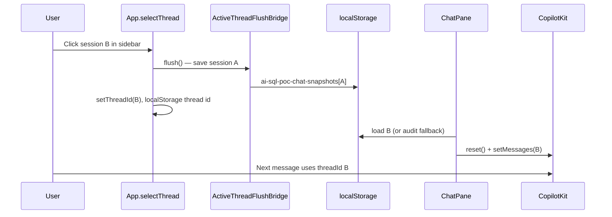

# Chat memory and session switching — learnings

What we learned building **chat history**, **session switching**, and **durable follow-up memory** in the CopilotKit POC. Use this when debugging blank panels, wrong-thread restores, or planning Postgres.

**Architecture reference:** [chat-memory-and-sessions.md](../architecture/chat-memory-and-sessions.md)  
**Storage map:** [query-and-memory-storage.md](../architecture/query-and-memory-storage.md)  
**Postgres setup:** [postgres-local-dev.md](../architecture/postgres-local-dev.md)  
**CopilotKit wiring:** [copilotkit-local-ui-learnings.md](./copilotkit-local-ui-learnings.md)

---

## Four stores — don’t conflate them

| Store | Purpose | Survives API restart? | Survives browser refresh? |
|-------|---------|----------------------|---------------------------|
| **LangGraph checkpointer** | Agent follow-ups (“same but by region”) | **Yes** with Postgres; **no** with `MemorySaver` | N/A (server-side) |
| **Browser chat snapshots** | What the UI displays | N/A | Yes (`localStorage`) |
| **S3 audit log** | Compliance / debug per run | Yes | Yes (via API) |
| **Wren memory** | Semantic NL↔SQL recall (Wren mode) | Yes (on disk under `wren/tpch/target/`) | N/A |

The sidebar **Chat history** list is derived from **audit**, not a sessions table. That was fine for a POC but is the wrong long-term source of truth for UX.

---

## CopilotKit: premium threads vs our POC

CopilotKit’s **premium** model (`useThreads`, `CopilotChat threadId` + server replay) needs Copilot Cloud / Enterprise Intelligence Platform. On thread switch it:

1. Detaches the active run
2. Clears messages
3. Fetches the selected thread’s history from the server
4. Reconnects the stream

We are **self-hosted** with `HttpAgent` → AG-UI → FastAPI. There is no CopilotKit thread store. Docs explicitly say for **client-only** history: manage messages in React state / localStorage (or your own API).

**Implication:** Do not expect `threadId` on `CopilotChat` alone to restore history. We must **load** and **apply** messages ourselves.

---

## Session switching — working pattern (Jun 2026)

After several failed attempts (bootstrap/restore races, remounting `CopilotKit` on every thread change, clearing messages before save), this pattern works:

| Step | Code | Why |
|------|------|-----|
| 1 | `selectThread(id)` calls `flush()` **before** `setThreadId` | Outgoing thread must be saved while messages still exist |
| 2 | `CopilotKit threadId={threadId}` | Aligns AG-UI / LangGraph `configurable.thread_id` |
| 3 | `ChatPane` loads **only that id** via `resolveThreadMessages` | localStorage first, then `GET /api/audit/logs?thread_id=` |
| 4 | `reset()` then `setMessages(loaded)` | CopilotKit has one global message store — explicit apply |
| 5 | Re-click active session → `reloadNonce++` | User can force reload without changing id |

**Key files:** `ui/src/App.tsx`, `ui/src/components/ChatPane.tsx`, `ui/src/components/ActiveThreadFlushBridge.tsx`, `ui/src/hooks/useActiveThreadPersistence.ts`, `ui/src/lib/resolveThreadMessages.ts`

---

## Pitfalls we hit

### 1. Single global CopilotKit message store

`useCopilotChatHeadless_c()` is shared under one `<CopilotKit>` provider. `key={threadId}` on `CopilotChat` remounts the **UI**, not the underlying message context. Partial remounts + async `setMessages` caused blank or stale panels.

**Fix:** Save-before-switch + explicit load for the target thread. One code path, not three components fighting the same store.

### 2. Clearing before save

Switching `threadId` unmounted chat and cleared messages **before** the outgoing thread was persisted → empty snapshots overwrote good data.

**Fix:** `useLayoutEffect` / synchronous `flush()` in `selectThread` before state update.

### 3. Stale boot state

Rendering `CopilotChat` with new `threadId` but old loaded messages showed the wrong conversation briefly.

**Fix:** Show “Loading conversation…” until `resolveThreadMessages(threadId)` completes for **that** id.

### 4. Audit ≠ transcript

Audit stores one JSON per **run** (`question`, SQL steps, timing). It does not store full assistant prose or tool UI state. Audit fallback restore is Q&A-shaped, not pixel-perfect chat.

### 5. Sidebar vs active thread on refresh

`localStorage` key `ai-sql-poc-thread-id` holds the **last selected** thread, not “latest in sidebar.” Sidebar is sorted by audit `last_timestamp`; active thread is whatever you last clicked (if flush + save worked).

### 6. Server follow-up vs UI restore

After API restart with `MemorySaver`, the UI can show old messages (localStorage/audit) while LangGraph has **no** checkpoint — follow-ups fail silently. **Postgres checkpointer** fixes server-side persistence; UI still needs its own transcript store for rich replay (Phase 3.6.2).

---

## Postgres + Docker Compose (Phase 3.6.1)

**Goal:** LangGraph follow-ups survive `uvicorn` restart.

| Component | Role |
|-----------|------|
| `docker-compose.yml` | Postgres 16 on `localhost:5432` |
| `DATABASE_URL` in `.env` | Enables `PostgresSaver` instead of `MemorySaver` |
| `src/checkpoint_factory.py` | Pool + `setup()` on API startup |
| `GET /api/status` → `checkpoint.backend` | `memory` or `postgres` |

CLI (`src/ask_deep_agent.py`) still uses in-memory checkpoints — only the API opts into Postgres when `DATABASE_URL` is set.

**Not done yet (3.6.2+):** `conversations` / `messages` tables, server-side session list, UI loading from API instead of localStorage-first.

---

## Production-shaped target (CTA)

1. **Postgres checkpointer** — LangGraph state per `thread_id` (3.6.1 — started)
2. **Sessions + messages API** — source of truth for sidebar and transcript (3.6.2)
3. **Keep S3 audit** — compliance, separate from UX
4. **User scoping** — `user_id` on sessions when auth exists (3.6.4)
5. **localStorage as cache** — optional offline hint, not authority (3.6.6)

See [Phase 3.6 in the CopilotKit plan](../plans/2026-05-29-004-feat-copilotkit-local-ui-plan.md).

---

## Quick troubleshooting

| Symptom | Likely cause | Check |
|---------|--------------|-------|
| Blank middle panel on session click | Save/load race (old bug) or no snapshot/audit for that thread | Re-click session; DevTools → `ai-sql-poc-chat-snapshots` |
| Wrong session after refresh | `ai-sql-poc-thread-id` not updated on last click | Application → localStorage |
| Messages visible, follow-up ignores context | API restarted with MemorySaver | Set `DATABASE_URL`, restart API; `/api/status` → `checkpoint.backend: postgres` |
| Session in sidebar but empty chat | No localStorage + audit has no rows for that `thread_id` | Audit logs page filtered by thread |
| Tool cards missing after restore | Snapshots store text only | Expected until server messages API exists |

---

## Related files

| Path | Role |
|------|------|
| `ui/src/App.tsx` | `selectThread`, `CopilotKit threadId`, `reloadNonce` |
| `ui/src/lib/chatPersistence.ts` | localStorage snapshots |
| `ui/src/lib/resolveThreadMessages.ts` | local → audit load |
| `src/agent_factory.py` | Graph + checkpointer injection |
| `src/checkpoint_factory.py` | Postgres pool lifecycle |
| `api/main.py` | Startup init, `/api/status` checkpoint field |
| `docker-compose.yml` | Local Postgres |
