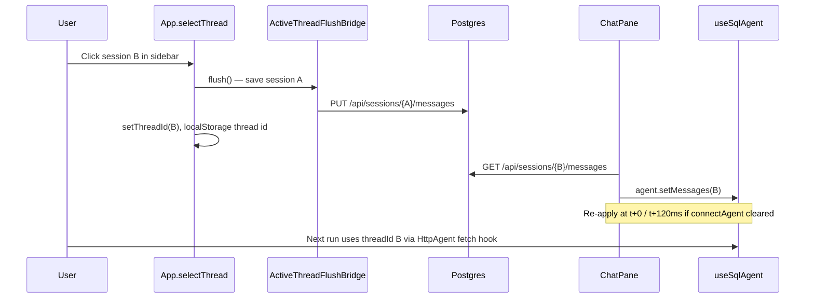

# Chat memory and session switching — learnings

What we learned building **chat history**, **session switching**, and **durable follow-up memory** in the CopilotKit POC. Use this when debugging blank panels, wrong-thread restores, or planning Postgres.

**Architecture reference:** [chat-memory-and-sessions.md](../architecture/chat-memory-and-sessions.md)  
**Storage map:** [query-and-memory-storage.md](../architecture/query-and-memory-storage.md)  
**Postgres setup:** [postgres-local-dev.md](../architecture/postgres-local-dev.md)  
**CopilotKit wiring:** [copilotkit-local-ui-learnings.md](./copilotkit-local-ui-learnings.md)

---

## Four stores — don’t conflate them

| Store | Purpose | Survives API restart? | Survives browser refresh? |
|-------|---------|----------------------|---------------------------|
| **LangGraph checkpointer** | Agent follow-ups (“same but by region”) | **Yes** with Postgres; **no** with `MemorySaver` | N/A (server-side) |
| **Postgres messages** | Chat transcript + sidebar (SQL chat) | **Yes** (when `DATABASE_URL` set) | N/A |
| **Browser chat snapshots** | Legacy only — one-time migration to Postgres | N/A | Migrated once, then deleted |
| **S3 audit log** | Compliance / debug per run | Yes | Yes (via API) |
| **Wren memory** | Semantic NL↔SQL recall (Wren mode) | Yes (on disk under `wren/tpch/target/`) | N/A |

**Target end-state for chat:** Postgres (sessions + messages) + S3 (audit page only). Wren memory is a separate concern; a future **Postgres pgvector** index could replace Wren’s on-disk memory for similar-question SQL recall — see [query-and-memory-storage.md](../architecture/query-and-memory-storage.md#future-postgres--pgvector-optional-replacement-for-wren-memory).

The sidebar **Chat history** list comes from **Postgres** (`GET /api/sessions`). SQL chat restore uses `GET /api/sessions/{id}/messages` only — no audit fallback (3.6.3 / 3.6.6).

---

## CopilotKit: premium threads vs our POC

CopilotKit’s **premium** model (`useThreads`, `CopilotChat threadId` + server replay) needs Copilot Cloud / Enterprise Intelligence Platform. On thread switch it:

1. Detaches the active run
2. Clears messages
3. Fetches the selected thread’s history from the server
4. Reconnects the stream

We are **self-hosted** with `HttpAgent` → AG-UI → FastAPI. There is no CopilotKit thread store. Docs explicitly say for **client-only** history: manage messages in React state / localStorage (or your own API).

**Implication:** Do not expect `threadId` on `CopilotChat` alone to restore history. We must **load** and **apply** messages ourselves.

---

## Session switching — working pattern (PR #11, Jun 2026)

After several failed attempts (bootstrap/restore races, remounting `CopilotKit` on every thread change, clearing messages before save, **`CopilotKit threadId` wiping the store**, multiple hooks each calling `connectAgent`), this pattern works:

| Step | Code | Why |
|------|------|-----|
| 1 | `selectThread(id)` calls `flush()` **before** `setThreadId` | Outgoing thread must be saved while messages still exist |
| 2 | **Do not** pass `threadId` to `<CopilotKit>` | CopilotKit reconnects the agent and calls `setMessages([])` on thread change |
| 3 | `HttpAgent` injects `threadId` per request via `threadIdRef` | LangGraph still gets the correct `configurable.thread_id` without remounting CopilotKit |
| 4 | Single `useSqlAgent()` → `useAgent({ agentId })` | Multiple `useCopilotChatHeadless` / internal hooks each trigger `connectAgent` and clear messages |
| 5 | `ChatPane` loads via `resolveThreadMessages` | Postgres only (`GET /api/sessions/{id}/messages`) |
| 6 | `agent.setMessages(loaded)` + `copilotOwnerThreadIdRef` | One global message store — explicit apply; ref gates autosave to the owning thread |
| 7 | Re-apply at 0 ms and 120 ms if count drops | `CopilotChat`’s internal `connectAgent` clears messages once on mount |
| 8 | Keep `<CopilotChat>` mounted during load (overlay) | Unmounting triggers another connect/clear cycle |
| 9 | Re-click active session → `reloadNonce++` | User can force reload without changing id |
| 10 | **+ New** starts a fresh UUID (no Clear button) | Avoids accidental wipe; old checkpoints remain on server |

**Key files:** `ui/src/App.tsx`, `ui/src/components/ChatPane.tsx`, `ui/src/components/ActiveThreadFlushBridge.tsx`, `ui/src/hooks/useActiveThreadPersistence.ts`, `ui/src/hooks/useSqlAgent.ts`, `ui/src/lib/resolveThreadMessages.ts`, `ui/src/lib/httpAgent.ts`

---

## Pitfalls we hit

### 1. Single global CopilotKit message store

`useAgent` / CopilotKit share one message list under `<CopilotKit>`. `key={threadId}` on `CopilotChat` remounts the **UI**, not the underlying agent context. Partial remounts + async `setMessages` caused blank or stale panels.

**Fix:** Save-before-switch + explicit load for the target thread. One agent hook (`useSqlAgent`), not three components each calling headless chat APIs.

### 2. `connectAgent` clears messages on mount

`CopilotChat` internally calls `connectAgent`, which runs `setMessages([])` once when the chat UI mounts — **after** `ChatPane` may have already restored history.

**Fix:** After `agent.setMessages(loaded)`, schedule re-apply at 0 ms and 120 ms when `agent.messages.length < loaded.length` and `copilotOwnerThreadIdRef` still matches. Keep `CopilotChat` mounted (loading overlay only).

### 3. `CopilotKit threadId` prop (removed)

Passing `threadId={threadId}` to `<CopilotKit>` looked correct for LangGraph alignment but caused CopilotKit to reconnect and wipe messages on every session click.

**Fix:** Remove `threadId` from `<CopilotKit>`. Pass thread id only through `HttpAgent`’s fetch hook (`body.threadId = threadIdRef.current`) so server runs stay scoped without client-side reconnect.

### 4. Multiple agent hooks = multiple clears

`useCopilotChatHeadless`, `useActiveThreadPersistence`, and `ChatPane` each subscribed to the agent separately. Each subscription path could trigger `connectAgent` and race to clear messages.

**Fix:** Centralize on `useSqlAgent()` — thin wrapper around `useAgent({ agentId, updates })`. Components that need message watches pass `watchMessages: true`.

### 5. Autosave on the wrong thread

Debounced save in `useActiveThreadPersistence` used to fire when `threadId` changed, sometimes persisting an **empty** or **incoming** thread’s store over the outgoing session.

**Fix:** Only autosave when `threadId === copilotOwnerThreadIdRef.current`. Set the ref in `applyThreadMessages` after a successful restore. Never autosave on `threadId` change alone — rely on explicit `flush()` in `selectThread`.

### 6. Clearing before save

Switching `threadId` unmounted chat and cleared messages **before** the outgoing thread was persisted → empty snapshots overwrote good data.

**Fix:** Synchronous `flush()` in `selectThread` before `setThreadId`.

### 7. Stale boot state

Rendering `CopilotChat` with new `threadId` but old loaded messages showed the wrong conversation briefly.

**Fix:** Show “Loading conversation…” until `resolveThreadMessages(threadId)` completes for **that** id.

### 8. Audit ≠ transcript (SQL chat no longer uses audit for restore)

Audit stores one JSON per **run** (`question`, SQL steps, timing). It does not store full assistant prose or tool UI state.

**Fix (3.6.3):** SQL chat reads Postgres only. Editor chat still merges localStorage + audit. Use `scripts/backfill_chat_sessions_from_audit.py` for one-time migration of old threads.

### 9. Sidebar vs active thread on refresh

`localStorage` key `ai-sql-poc-thread-id` holds the **last selected** thread, not “latest in sidebar.” Sidebar is sorted by Postgres `updated_at`.

### 10. Server follow-up vs UI restore

After API restart with `MemorySaver`, the UI can show Postgres messages while LangGraph has **no** checkpoint — follow-ups fail silently. **Postgres checkpointer** fixes server-side persistence.

### 12. Server-side append (3.6.3b)

Even if the UI flush fails (tab close), each agent run calls `append_run_turn` in `ag_ui_agent.py` after audit write. Idempotent by `{run_id}-user` message id. UI flush still uses replace-all PUT for richer CopilotKit serialization.

### 11. Sync `PostgresSaver` breaks AG-UI chat

Using the sync `PostgresSaver` with the async FastAPI / AG-UI path caused `NotImplementedError` on chat runs — messages sent but no assistant response.

**Fix:** `AsyncPostgresSaver` + `AsyncConnectionPool` with `await conn.set_autocommit(True)` in `src/checkpoint_factory.py`; async `startup`/`shutdown` in `api/main.py`.

---

## Postgres + Docker Compose (Phase 3.6.1)

**Goal:** LangGraph follow-ups survive `uvicorn` restart.

| Component | Role |
|-----------|------|
| `docker-compose.yml` | Postgres 16 on `localhost:5432` |
| `DATABASE_URL` in `.env` | Enables `AsyncPostgresSaver` instead of `MemorySaver` |
| `src/checkpoint_factory.py` | Async pool + `await setup()` on API startup |
| `GET /api/status` → `checkpoint.backend` | `memory` or `postgres` |

CLI (`src/ask_deep_agent.py`) still uses in-memory checkpoints — only the API opts into Postgres when `DATABASE_URL` is set.

**Local dev without Docker:** Leave `DATABASE_URL` empty. API falls back to `MemorySaver`; SQL chat sidebar shows “Postgres required” — no audit fallback.

**Done (3.6.2–3.6.3b):** `conversations` / `messages` tables, Postgres-only SQL chat UX, `append_run_turn` on agent runs, one-time localStorage migration.

**Not done yet (Phase 2):** Per-thread message store in React context so background agent runs continue while the user switches to another session in the sidebar.

---

## Production-shaped target (CTA)

1. **Postgres checkpointer** — LangGraph state per `thread_id` (3.6.1)
2. **Sessions + messages API** — source of truth for sidebar and transcript (3.6.2 ✅)
3. **Postgres-only chat path** — no audit/localStorage authority for SQL chat (3.6.3 / 3.6.6 ✅)
4. **Server append on run** — `append_run_turn` after each agent run (3.6.3b ✅)
5. **Keep S3 audit** — compliance, Audit log page only
6. **User scoping** — `user_id` on sessions when auth exists (3.6.4)

See [Phase 3.6 in the CopilotKit plan](../plans/2026-05-29-004-feat-copilotkit-local-ui-plan.md).

---

## Quick troubleshooting

| Symptom | Likely cause | Check |
|---------|--------------|-------|
| Blank middle panel on session click | `connectAgent` cleared after restore, or save/load race | Re-click session (`reloadNonce`); confirm `useSqlAgent` is the only agent hook |
| Chat sends but no assistant reply | Sync checkpointer or Postgres pool timeout | `/api/status` → `checkpoint.backend`; API logs for `NotImplementedError`; Docker up if `DATABASE_URL` set |
| Messages flash then disappear | `CopilotKit threadId` or duplicate headless hooks | Ensure `<CopilotKit>` has **no** `threadId` prop; grep for extra `useCopilotChat` |
| Wrong session after refresh | `ai-sql-poc-thread-id` not updated on last click | Application → localStorage |
| Messages visible, follow-up ignores context | API restarted with MemorySaver | Set `DATABASE_URL`, restart API; `/api/status` → `checkpoint.backend: postgres` |
| Session in sidebar but empty chat | No Postgres rows for that `thread_id` | Run backfill script; ask a question (server append) |
| Outgoing session saved empty | `flush()` not called before switch, or autosave on wrong thread | Breakpoint in `selectThread` → `flushActiveThreadRef.current()` |
| Tool cards missing after restore | Snapshots store text only | Expected until server messages API exists |

---

## Related files

| Path | Role |
|------|------|
| `ui/src/App.tsx` | `selectThread`, `flush` wiring, stable `HttpAgent`, **no** `CopilotKit threadId` |
| `ui/src/hooks/useSqlAgent.ts` | Single shared `useAgent` handle |
| `ui/src/lib/httpAgent.ts` | Injects `threadId` + semantic layer per AG-UI request |
| `ui/src/lib/chatPersistence.ts` | `toStoredMessages`, API flush helpers (no localStorage authority) |
| `ui/src/lib/resolveThreadMessages.ts` | Postgres-only restore for SQL chat |
| `ui/src/lib/sessionApi.ts` | Sessions API client + one-time localStorage migration |
| `src/chat_sessions/store.py` | `append_run_turn`, CRUD |
| `ui/src/components/ChatPane.tsx` | Load, apply, re-apply after `connectAgent` clear |
| `src/agent_factory.py` | Graph + checkpointer injection |
| `src/checkpoint_factory.py` | Async Postgres pool lifecycle |
| `api/main.py` | Async startup init, `/api/status` checkpoint field |
| `docker-compose.yml` | Local Postgres |

**Merged:** [PR #11](https://github.com/amber-siru-lin/ai-sql-poc/pull/11) — `fix(ui): restore chat history when switching sessions`
